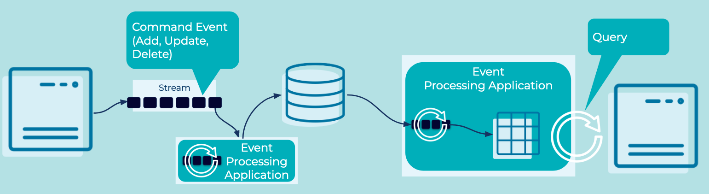

---
seo:
  title: Command Query Responsibility Segregation
  description: Command Query Responsibility Segregation (CQRS) describes segmentation of models for updating and querying of data.
---

# Command Query Responsibility Segregation (CQRS)
Databases conflate the writing of data and the reading of data in the same place: the database. In some situations, it is preferable to separate reads from writes. There are several reasons to do this but the most prevalent is that the application can now save data in the exact form in which it arrives, accurately reflecting what happened in the real world, while reading it in a different form, one that is optimized for reading. 

For example, a user adding and removing items from their cart would all be recorded as a stream of immutable events: t-shirt added, t-shirt removed, etc. These are then summarized into a separate view that used to serve reads, for example summarizing the various user events to represent the accurate contents of the cart. 

## Problem
How can we store and hold data in the exact form in which it arrived but read from a summarized and curated view?

## Solution


Represent changes that happen in the real world as [Events](../event/event.md) - an order is shipped, a ride is accepted, etc. - and retain these events as the system of record. Subsequently, aggregate those [Events](../event/event.md) into a view that summarizes the events to represent the current state, allowing applications to query the current values. 
So for example, the current balance of an account would be the total of all the payment events that added money to or removed it from the account. The system of record is the stream of payment events. The view read from it would be the account balance. 

## Implementation

The streaming database [ksqlDB](https://ksqldb.io/) can implement a CQRS using an [Event Stream](../event-stream/event-stream.md) and [Table](../table/state-table.md).

[Event Streams](../event-stream/event-stream.md) are built into to the streaming database design. Creating a new stream is straightforward:

```sql
CREATE STREAM purchases (customer VARCHAR, item VARCHAR, qty INT WITH (kafka_topic='purchases-topic', value_format='json', partitions=1);
```

[Events](../event/event.md) can be directly using familiar SQL syntax. 
```sql
INSERT INTO purchases (customer, item, qty) VALUES ('jsmith', 'hats', 1);
INSERT INTO purchases (customer, item, qty) VALUES ('jsmith', 'hats', 1);
INSERT INTO purchases (customer, item, qty) VALUES ('jsmith', 'pants', 1);
INSERT INTO purchases (customer, item, qty) VALUES ('jsmith', 'sweaters', 1);
INSERT INTO purchases (customer, item, qty) VALUES ('jsmith', 'pants', 1);
INSERT INTO purchases (customer, item, qty) VALUES ('jsmith', 'pants', -1);
```

We can create a [Materialized View](https://docs.ksqldb.io/en/latest/concepts/materialized-views/) of the data as a [Table](../table/state-table.md):
```sql  
CREATE TABLE customer_purchases WITH (KEY_FORMAT='JSON') AS
  SELECT customer, item, SUM(qty) as total_qty from purchases GROUP BY customer, item emit changes;
```

And continuously query for changes to the state of the `customer_purchases` table:
```sql 
SELECT * FROM customer_purchases EMIT CHANGES;
```

## Considerations
* CQRS adds complexity over a traditional simple [CRUD](https://en.wikipedia.org/wiki/Create,_read,_update_and_delete) database implementation.

* High performance applications may benefit from a CQRS design. Isolating the load of writing and reading of data may allow us to scale those aspects independently and properly. 

* Microservices applications often use CQRS to scale-out with many views provided for different services. The same pattern is applicable to geographically dispersed applications such as a flight booking system which are read heavy across many locations.

* A write to a CQRS system is eventually consistent. Writes cannot be read immediately as there is a delay between the write of the command [Event](../event/event.md) and the query-model being updated. This can cause complexity for some client applications, particularly online services.


## References
* See Martin Fowler's [detailed explanation of CQRS](https://martinfowler.com/bliki/CQRS.html) for more information.
