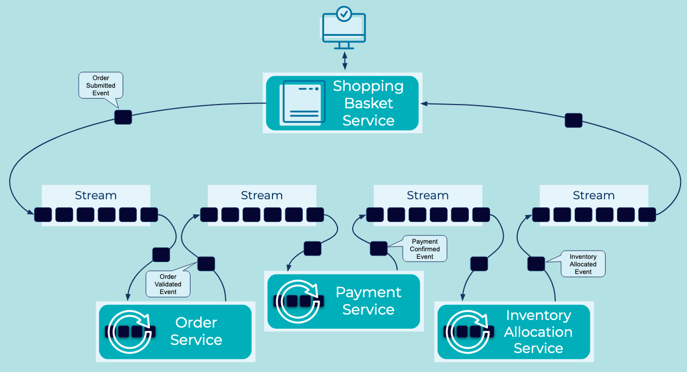

# Event Collaboration
Building distributed business workflows requires coordinating multiple services and [Event Processing Applications](../event-processing/event-processing-application.md). Business actions and reactions must be coordinated asynchronously as complex workflows transition through various states.

## Problem
How can I build a distributed workflow in a way that allows components to evolve independently? 

## Solution

Event Collaboration allows services and applications to collaborate around a single business workflow on top of an [Event Streaming Platform](../event-stream/event-streaming-platform.md). Service components publish [Events](../event/events.md) to [Event Streams](../event-stream/event-streams.md) as notification of the completion of a step in the workflow. The Events serve the additional purpose of carrying state information about the workflow which is used by downstream components in the next steps of the workflow. The process repeats the until the workflow is complete.

## Considerations
* In Event Collaboration, the logic for the choreography of the progression of the business workflow is decentralized and spread across many components. This contrasts with traditional orchestration design where the logic is isolated in a dedicated "controller" service that coordinates the actions and reactions of the workflow components.

* With Event Collaboration, some workflow components will need to be able to ascertain the state of the workflow some time after they have generated their own Event. A classic example would be an order request service which generates a new order request event and wants to be notified when the order is complete. These Events need to be correlated through the distributed workflow to support such functionality. The [Correlation Identifier](../event/correlation-identifier.md) pattern describes a method of coupling Events when processed asyncronously by way of a global identifier which traverses the workflow within the events.

## References
* TODO: pointers to related patterns?
* TODO: pointers to external material?

