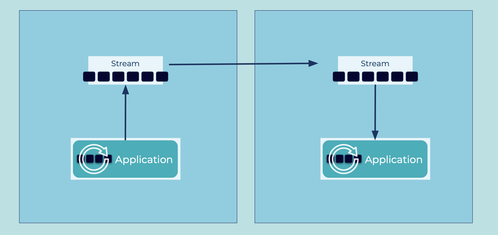

# Event Stream Observer
Many architectures have streams of events deployed across multiple datacenters across boundaries of event streaming platforms, datacenters, or geo-regions.
In these situations, it may be useful for client applications in one datacenter to have access to events produced in another datacenter.
The applications in the destination are "observers" of the original data written in the source.

## Problem
How can multiple event streaming platforms be connected so that events available in one site are also available on the others?

## Solution

Using a "pull" method, create a connection between the two systems, enabling the destination system to read from the source system.
Ideally this is done in realtime such that as new events are published in the source datacenter, they can be immediately copied, byte for byte, to the destination datacenter.
This allows the client applications in the destination to leverage the same set of data.

## Implementation
Practically, replication is not enabled on two complete datacenters, as there are always exceptions, organizational limitations, technical constraints, or other reasons why you wouldn't want to copy absolutely everything.
Instead, you can do this on a per topic basis, where you can map a source topic to a destination topic.

With Apache Kafka, you can do this in one of several ways.

Option 1: [Cluster Linking](https://docs.confluent.io/cloud/current/multi-cloud/cluster-linking.html)

Cluster Linking enables easy data sharing between datacenters, by enabling topics to be mirrored across clusters.
Because Cluster Linking uses native replication protocols instead of a separate service, client applications can easily failover in the case of a disaster recovery scenario.

```
ccloud kafka link create east-west --cluster <destination> --source_cluster <source> ...
```

Option 2: [MirrorMaker](https://kafka.apache.org/documentation/#georeplication)

Operators can set up such inter-cluster data flows with Kafka's MirrorMaker (version 2), a tool to replicate data between different Kafka environments.
Unlike Cluster Linking, it's a separate service built upon Kafka Connect, with built-in producers and consumers.

## Considerations
Note that this type of replication between clusters is asynchronous, which means an event that is recorded in the source cluster may be available before that event is recorded in the destination cluster.
There is also synchronous replication across clusters (e.g. [Multi Region Clusters](https://docs.confluent.io/platform/current/multi-dc-deployments/index.html)) but this is often limited to when the datacenters are in the same operational domain.

## References
* This pattern is derived from [Message Bridge](https://www.enterpriseintegrationpatterns.com/patterns/messaging/MessageBridge.html) in Enterprise Integration Patterns by Gregor Hohpe and Bobby Woolf
