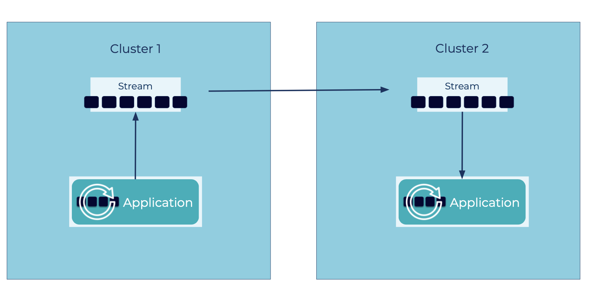

---
seo:
  title: Geo Replication
  description: Geo Replication enables multiple Event Streaming Platforms to be connected so that events available in one site are also available on the others
---

# Geo Replication
Many architectures have streams of events deployed across multiple datacenters spanning boundaries of [Event Streaming Platforms](../event-stream/event-streaming-platform.md), datacenters, or geographical regions.
In these situations, it may be useful for client applications in one event streaming platform to have access to [Events](../event/event.md) produced in another one.
All clients shouldn't be forced to read from the source event streaming platform, which can incur high latency and data egress costs.
Instead, with a move-once-read-many approach, the data can be replicated to a local datacenter where clients can do all their processing quickly and cheaply.

## Problem
How can multiple [Event Streaming Platforms](../event-stream/event-streaming-platform.md) be connected so that events available in one site are also available on the others?

## Solution

Create a connection between the two [Event Streaming Platforms](../event-stream/event-streaming-platform.md), enabling the destination platform to read from the source one.
Ideally this is done in realtime such that as new events are published in the source event streaming platform, they can be immediately copied, byte for byte, to the destination event streaming platform.
This allows the client applications in the destination to leverage the same set of data.

## Implementation
Practically, replication is not enabled completely on all data streams, as there are always exceptions, organizational limitations, technical constraints, or other reasons why we wouldn't want to copy absolutely everything.
Instead, we can do this on a per topic basis, where we can map a source topic to a destination topic.

With Apache Kafka®, we can do this in one of several ways.

### Option 1: Cluster Linking

[Cluster Linking](https://docs.confluent.io/cloud/current/multi-cloud/cluster-linking.html) enables easy data sharing between event streaming platforms, mirroring topics across them.
Because Cluster Linking uses native replication protocols, client applications can easily failover in the case of a disaster recovery scenario.

```sh
ccloud kafka link create east-west ...
ccloud kafka topic create <destination topic> --link east-west --mirror-topic <source topic> ...
```

Other messaging systems like RabbitMQ, Active MQ, etc., provide similar functionality but without the same levels of parallelism.

### Option 2: Connect-based Replication

Operators can set up such inter-cluster data flows with Confluent's [Replicator](https://docs.confluent.io/cloud/current/clusters/migrate-topics-on-cloud-clusters.html) or Kafka's [MirrorMaker](https://kafka.apache.org/documentation/#georeplication) (version 2), tools that replicate data between different Kafka environments.
Unlike Cluster Linking, these are separate services built upon Kafka Connect, with built-in producers and consumers.

## Considerations
Note that this type of replication between event streaming platforms is asynchronous, which means an event that is recorded in the source may not be immediately available at the destination.
There is also synchronous replication across event streaming platforms (e.g. [Multi Region Clusters](https://docs.confluent.io/platform/current/multi-dc-deployments/index.html)) but this is often limited to when the event streaming platforms are in the same operational domain.

## References
* This pattern is derived from [Messaging Bridge](https://www.enterpriseintegrationpatterns.com/patterns/messaging/MessagingBridge.html) in Enterprise Integration Patterns by Gregor Hohpe and Bobby Woolf
