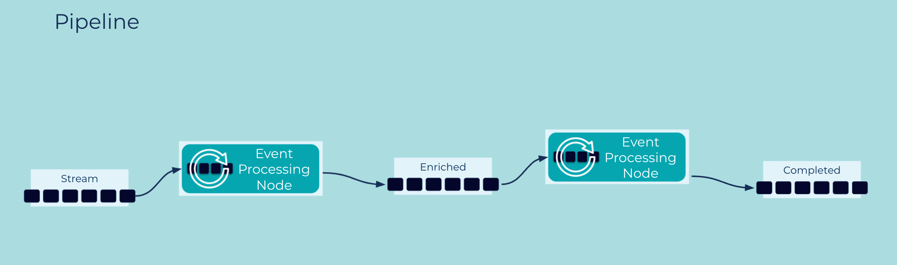

---
seo:
  title: Pipeline
  description: Perform a complex operation on a series of events, in an event stream or table, through a series of independant processing stages.
---

# Pipeline

A single [Event Stream](../event-stream/event-stream.md) or [Table](../table/state-table.md) can be used by multiple [Event Processing Applications](../event-processing/event-processing-application.md), and its [Events](../event/event.md) may go through multiple processing stages along the way (e.g., filters, transformations, joins, aggregations) to implement more complex use cases.

## Problem

How can a single processing objective for a set of Event Streams and/or Tables be achieved through a series of independent processing stages?

## Solution


We can compose [Event Streams](../event-stream/event-stream.md) and [Tables](../table/state-table.md) in an [Event Streaming Platform](../event-stream/event-streaming-platform.md) via an [Event Processing Application](../event-processing/event-processing-application.md) to a create a pipeline—also called a topology—of [Event Processors](../event-processing/event-processor.md), which continuously process the events flowing through them. Here, the output of one processor is the input for one or more downstream processors. Pipelines, notably when created for use cases such as Streaming [ETL](https://en.wikipedia.org/wiki/Extract,_transform,_load), may include [Event Source Connectors](../event-source/event-source-connector.md) and [Event Sink Connectors](../event-sink/event-sink-connector.md), which continuously import and export data as streams from/to external services and systems, respectively. Connectors are particularly useful for turning data at rest in such systems into data in motion.

Taking a step back, we can see that pipelines in an Event Streaming Platform help companies build a "central nervous system" for data in motion.

## Implementation

As an example we can use the streaming database ksqlDB to run a stream of events through a series of processing stages, thus creating a Pipeline that continuously processes data in motion.

```sql
CREATE STREAM orders ( 
  customer_id INTEGER, items ARRAY<STRUCT<name VARCHAR, price DOUBLE>>
) WITH (
  kafka_topic = 'orders', partitions = 1, value_format = 'AVRO'
);
```

Next, we create a new stream by joining the original stream with a table of customer data:

```sql
CREATE STREAM orders_enriched WITH 
(KAFKA_TOPIC='orders_enriched', PARTITIONS=1, VALUE_FORMAT='AVRO')
AS SELECT o.customer_id AS cust_id, o.items, c.name, c.address
FROM orders o LEFT JOIN customers c 
ON o.customer_id = c.customer_id
EMIT CHANGES;
```

Next, we create a stream, where we add the order total to each order by aggregating the price of the individual items in the order:

```sql
CREATE STREAM orders_with_totals
WITH (KAFKA_TOPIC='orders_totaled', PARTITIONS=1, VALUE_FORMAT='AVRO')
AS SELECT cust_id, items, name, address,  
  REDUCE(TRANSFORM(items, i=> i->price ), 0E0, (i,x) => (i + x)) AS total 
FROM orders_enriched
EMIT CHANGES;
```

## Considerations
* The same event stream or table can participate in multiple pipelines. Because streams and tables are stored durably, applications have a lot of flexibility how and when they process the respective data, and they can do so independently from each other.
* The various processing stages in a pipeline create their own derived streams/tables (such as the `orders_enriched` stream in the ksqlDB example above), which in turn can be used as input for other pipelines and applications. This allows for further and more complex composition and re-use of events throughout an organization.

## References
This pattern was influenced by [Pipes and Filters](https://www.enterpriseintegrationpatterns.com/patterns/messaging/PipesAndFilters.html) in Enterprise Integration Patterns by Gregor Hohpe and Bobby Woolf. However, it is much more powerful and flexible because it is using [Event Streams](../event-stream/event-stream.md) as the pipes.
