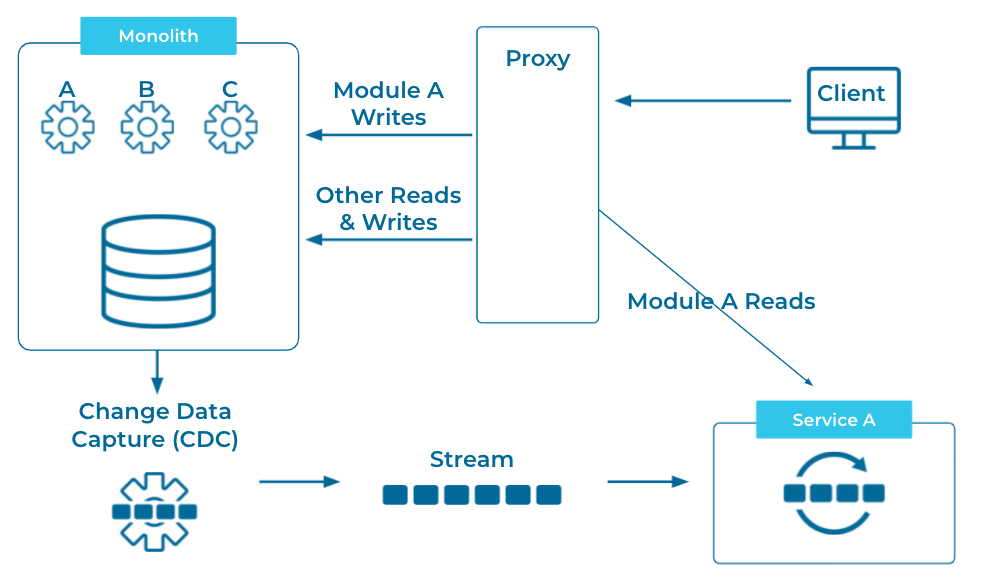
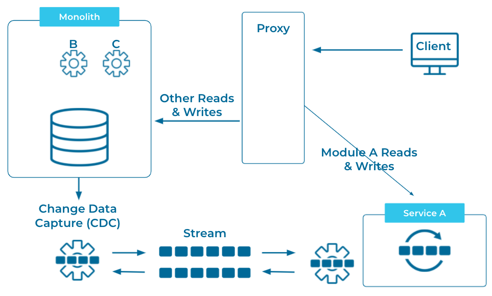

---
seo:
  title: Strangler Fig
  description: Migrate from a monolithic application architecture to microservices in a controlled, step-by-step fashion using CDC and event streams.
---

# Strangler Fig
Move functionality from a montolithic application to microservices gradually until the monolith is no longer being used and can be shut down.

## Problem
How can we migrate a monolithic application to a microservices architecture without the risks associated with a large cut-over rewrite?

## Solution

We can use the Strangler Fig pattern to migrate from a monolith to microservices safely and gradually.

## Implementation

First we identify a module of the monolith, or a set of existing APIs that will be replaced by our first microservice. We'll call this moduleA. Then we can use change data capture (CDC) to convert any changes to moduleA data to an [Event Stream](../event-stream/event-stream.md) that will feed our microservice. 

Then we will place a proxy between the monolith and any clients, with all read calls to moduleA being routed to our microservice. 

When our microservice is ready to handle writes, we can change the proxy to route all moduleA writes as well.  At this point, we can, again, use CDC to stream changes back to our monolith so it doesn't know what it's missing. 

As we continue this process with more modules, we gradually replace the functionality of the monolith until it can be shut down safely. 

## Considerations

The [Event Streams](../event-stream/event-stream.md) that we create using CDC are not only there for feeding the microservices, but are also available to be used by other applications. So that the Strangler Fig pattern is not only helpful in replacing legacy application, but can be used to gradually transform our enterprise architecture to an [Event Streaming Platform]()

## References

This pattern was originally articulated by Martin Fowler in his post: [Strangler Fig Application](https://martinfowler.com/bliki/StranglerFigApplication.html).  There is also a good representation of it among [Microsoft's Cloud Design Patterns](https://docs.microsoft.com/en-us/azure/architecture/patterns/strangler-fig). Gunnar Morling and Hans-Peter Grahsl demonstrate this pattern in a [presentation from Kafka Summit Europe 2021](https://www.confluent.io/events/kafka-summit-europe-2021/advanced-change-data-streaming-patterns-in-distributed-systems/).

