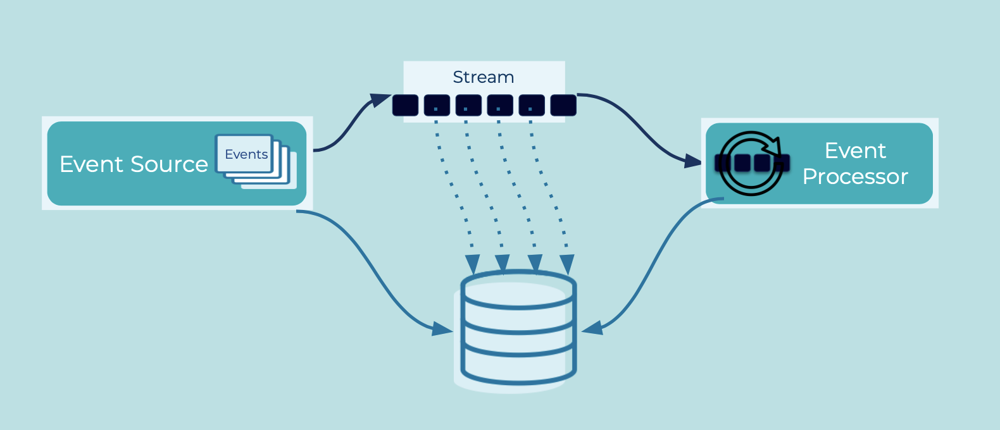

---
seo:
   title: Claim Check
   description: If an event streaming platform has some natural or configured size limit for the events, instead of storing the entire event, just store a reference to the event
---

# Claim Check

Sometimes compression can reduce message size but there are various use cases that entail large message payloads where compression may not be enough.
Often these use cases are related to image, video, or audio processing: image recognition, video analytics, audio analytics, etc.

## Problem

How can we handle use cases where the [Event](../event/event.md) payload is too large or too expensive to move through the [Event Streaming Platform](../event-stream/event-streaming-platform.md)?

## Solution



Instead of storing the entire event in the event streaming platform, store the event payload in a persistent external store that can be shared between producers and consumers.
The producer can write the reference address into the event streaming platform, and downstream clients use the address to retrieve the event from the external store and then process it as needed.

## Implementation

The event stored in Kafka contains only a reference to the object in the external store.
This can be a full URI string, an [abstract data type](https://en.wikipedia.org/wiki/Abstract_data_type) (e.g., Java object) with separate fields for bucket name and filename, or whatever fields are required to identify the object. Optionally, the event may contain additional data fields to better describe the object (e.g., metadata such as who created the object).

```java
  // Write object to external storage
  storageClient.putObject(bucketName, objectName, object);

  // Write URI to Kafka
  URI eventValue = new URI(bucketName, objectName);
  producer.send(new ProducerRecord<String, URI>(topic, eventKey, eventValue));
```

## Considerations

The [Event Source](../event-source/event-source.md) is responsible for ensuring that the data is properly stored in the external store, such that the reference passed within the [Event](../event/event.md) is valid.
Since the producer should be doing this atomically, take into consideration the same issues as mentioned in [Database Write Aside](../event-source/database-write-aside.md).

Also, any Kafka compaction on a topic would just remove the message with the reference, it would not remove the data from the external store, so that data needs another expiry mechanism.

## References
* This pattern is similar in idea to [Claim Check](https://www.enterpriseintegrationpatterns.com/patterns/messaging/StoreInLibrary.html) in Enterprise Integration Patterns by Gregor Hohpe and Bobby Woolf
* An alternative approach to handling large messages is [Event Chunking](../event-processing/chunking.md)
