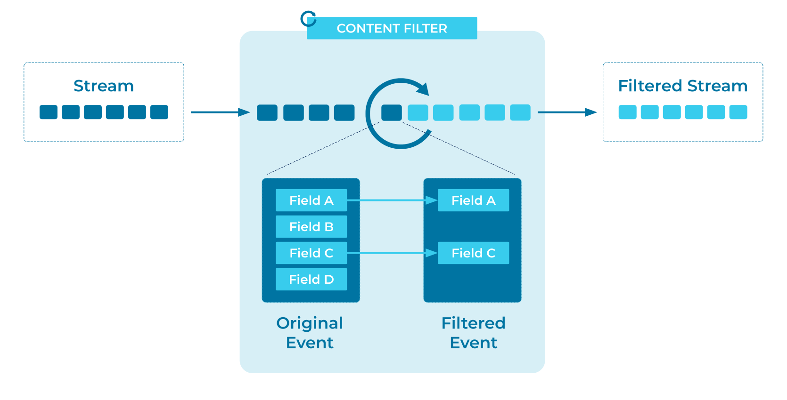

---
seo:
  title: Content Filter
  description: A Content Filter allows an Event Processing Application to tailor events to particular use cases, filtering out unwanted fields and leaving only the most relevant information.
---

# Content Filter

[Events](../event/event.md) in an [Event Processing
Application](event-processing-application.md) can often be very
large. We tend to capture data exactly as it arrives, and then process
it, rather than processing it first and only storing the results. So
the event that we want to consume often contains much
more information than we actually need for the task in hand.

For example, we might pull in a product feed from a third-party API and
store that data exactly as it was received. Later, we might ask the
question, "How many products are in each product category?" and find
that every event contains 100 fields, when we're really only
interested in counting one. At the very least, this is inefficient;
the network, memory, and serialization costs are 100x higher than they
need to be.  But manually inspecting the data actually becomes
painful -- hunting through 100 fields to find and check
the one that we care about.

Equally important, we may have security and data privacy concerns to
address. Imagine that we have a stream of data representing users' personal
details and site preferences. If the marketing department wants to get
more information about our global customer base, we might be able to
share the users' timezone and currency settings, but _only those
fields_.

We need a method of storing complete events while only giving
consumers a subset of the event fields.

## Problem

How can I simply consume only a few data items from a large event?

## Solution



Create an [Event Processor](event-processor.md) that inspects each
event, pulls out the fields of interest, and passes new, smaller
events downstream for further processing.

## Implementation

As an example, in [Apache Flink® SQL](https://nightlies.apache.org/flink/flink-docs-stable/docs/dev/table/sql/gettingstarted/),
we can use a `SELECT` statement to easily transform a rich event stream into a stream of simpler events.

Assume that we have a table called `products`, where each event contains a huge number of fields. We are only interested 
in four fields: `producer_id`, `category`, `sku`, and `price`. We can prune down the events to just those fields with 
the following query:

```sql
CREATE TABLE product_summaries AS
  SELECT
    product_id,
    category,
    sku,
    price
  FROM products;
```

We can perform an equivalent transformation using the Apache Kafka®
client library [Kafka Streams](https://docs.confluent.io/platform/current/streams/index.html),
perhaps as part of a larger processing pipeline:

```java
builder.stream("products", Consumed.with(Serdes.Long(), productSerde))
    .mapValues(
        (product) -> {
          ProductSummary summary = new ProductSummary();

          summary.setCategory(product.getCategory());
          summary.setSku(product.getSku());
          summary.setPrice(product.getPrice());

          return summary;
        })
    .to("product_summaries", Produced.with(Serdes.Long(), productSummarySerde));
```

## Considerations

Since filtering the content creates a new stream, it's worth
considering how the new stream will be partitioned, as discussed in the
[Partitioned Placement](../event-stream/partitioned-parallelism.md) pattern. By default, the
new stream will inherit the same partitioning key as its source, but
we can repartition the data to suit our new use case (for example, by
specifying a `DISTRIBUTED BY` clause in Flink SQL).

In the example above, our third-party product feed might be partitioned
by the vendor's unique `product_id`, but for this use case, it might
make more sense to partition the filtered events by their `category`.

See Flink's Kafka connector sink partitioning [documentation](https://nightlies.apache.org/flink/flink-docs-stable/docs/connectors/table/kafka/#sink-partitioning) for details.

## References
* This pattern is derived from [Content
  Filter](https://www.enterpriseintegrationpatterns.com/patterns/messaging/ContentFilter.html)
  in _Enterprise Integration Patterns_, by Gregor Hohpe and Bobby Woolf.
* For filtering out entire events from a stream, consider the [Event
  Filter](../event-processing/event-filter.md) pattern.
