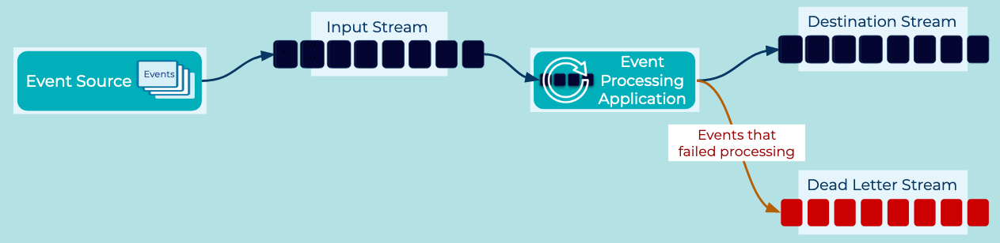

# Dead Letter Stream

<!-- TODO: Event Processing Application is a pattern that should be linked to in the following text -->
[Event Processing Applications](event-processing-application.md) may encounter invalid data as they operate over the infinite stream of events. Errors may include invalid data formats, nonsensical, missing or corrupt values, technical failures, or other unexpected scenarios.

## Problem
How can an event processing application handle processing failures without terminating, or becoming stuck, when a message cannot be read?

## Solution


When the event processing application cannot process an event for an unrecoverable reason, the problematic event is published to a “dead letter stream”. This stream stores the event allowing it to be logged, reprocessed later, or otherwise acted upon. Additional contextual information can be provided in the "dead letter event" to ease fault resolution later, such as details on why its processing failed.

## Implementation

Java Basic Kafka Consumer
```java
while (keepConsuming) {
  try {
    final ConsumerRecords<K, V> records = consumer.poll(Duration.ofSeconds(1));
    try {
      eventProcessor.process(records);
    } catch (Exception ex) {
      deadEventReporter.report(/*Error Details*/);
    }
  }
  catch (SerializationException se) {
    deadEventReporter.report(/*Error Details*/);
  }
}
```

Python Basic Kafka Consumer
```python
while True:
    try:
        event = consumer.poll(1000)

    except SerializerError as e:
        deadEventReporter.report(e)
        break

    if msg.error():
        deadEventReporter.report(msg.error())
        continue

    if msg is None:
        continue

    eventProcessor.process(msg)
```

## Considerations
What should real-world applications do with the events in the dead letter stream? Reprocessing events automatically will often lead to reorderings and hence the potential for corruption to downstream systems if the stream contains events that represent changing states of the same underlying entity, such as orders being booked, processed, or shipped. Manual reprocessing can be useful, but is often viewed more as an error log in many real-world implementations.

## References
* This pattern is derived from [Dead Letter Channel](https://www.enterpriseintegrationpatterns.com/patterns/messaging/DeadLetterChannel.html) in Enterprise Integration Patterns by Gregor Hohpe and Bobby Woolf
* Confluent’s [Schema Registry](https://docs.confluent.io/platform/current/schema-registry/index.html) provides data governance capabilities including “schema on write” enforcement which can help insulate downstream consumers from unexpected event formats.
* Kafka Streams provides the ability to register a customer Serde to handle corrupt records allowing for creation of Dead Event data which could be published to a Dead Event Stream. See this Confluent [Kafka Streams FAQ](https://docs.confluent.io/platform/current/streams/faq.html#streams-faq-failure-handling-deserialization-errors-serde) for details.
* [ksqlDB](https://ksqldb.io/) emits a stream of records, called the [Processing Log](https://docs.ksqldb.io/en/latest/reference/processing-log/), which is analogous to a Dead Letter Stream. The Processing Log contains structured events including processing errors and additional debugging details for ksqlDB applications.  See this [Kafka Tutorial](https://kafka-tutorials.confluent.io/handling-deserialization-errors/ksql.html) for more information.

