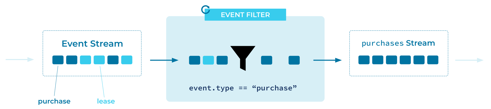

---
seo:
  title: Event Filter
  description: Lorem ipsum dolor sit amet, consectetur adipiscing elit. Donec rhoncus aliquet consequat. Morbi nec lorem eget mauris posuere consequat in vel sem. Nunc ut malesuada est, fermentum tristique velit. In in odio dui. Nunc sed iaculis mauris. Donec purus tellus, fringilla nec tempor et, tristique sit amet nulla. In pharetra ligula orci, eget mattis odio luctus eu. Praesent porttitor pretium dolor, ut facilisis tortor dignissim vitae.
---

# Event Filter
[Event Processors](event-processor.md) may need to operate over a subset of [Events](../event/event.md) over a particular [Event Stream](../event-stream/event-stream.md).

## Problem
How can an application discard uninteresting events?

## Solution



## Implementation
The Kafka Streams DSL provides a `filter` operator which filters out events that do not match a given predicate.

```java
KStream<String, Event> eventStream = builder.stream(.....);
eventStream.filter((key, value) -> value.type() == "foo").to("foo-events");
```

## References
* This pattern is derived from [Message Filter](https://www.enterpriseintegrationpatterns.com/patterns/messaging/Filter.html) in Enterprise Integration Patterns by Gregor Hohpe and Bobby Woolf
* See this [Kafka Tutorial](https://kafka-tutorials.confluent.io/filter-a-stream-of-events/ksql.html) for a full example of filtering event streams.

