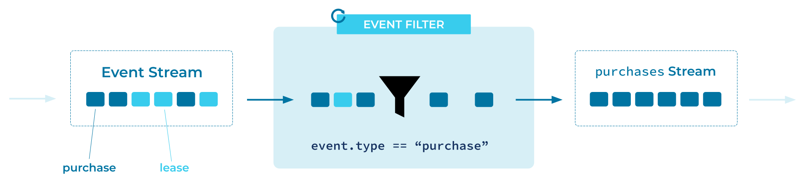

---
seo:
  title: Event Filter
  description: Event Filter allows event processing applications to operate over a subset of Events in an Event Stream
---

# Event Filter
[Event Processing Applications](event-processing-application.md) may need to operate over a subset of [Events](../event/event.md) in an [Event Stream](../event-stream/event-stream.md).

## Problem
How can an application select only the relevant events (or discard uninteresting events) from an Event Stream?

## Solution


## Implementation

As an example, the streaming database [ksqlDB](https://ksqldb.io) provides the ability to create a filtered Event Stream using familiar SQL syntax:
```sql
CREATE STREAM payments_only WITH (kafka_topic = 'transactions-topic') AS
    SELECT *
      FROM all_transactions
      WHERE type = 'purchase';
```

The [Kafka Streams client library](https://docs.confluent.io/platform/current/streams/index.html) of Apache Kafka® provides a `filter` operator in its DSL, which filters out events that do not match a given predicate.

```java
builder
  .stream("transactions-topic")
  .filter((key, transaction) -> transaction.type == "purchase")
  .to("payments-topic");
```

## References
* This pattern is derived from [Message Filter](https://www.enterpriseintegrationpatterns.com/patterns/messaging/Filter.html) in Enterprise Integration Patterns by Gregor Hohpe and Bobby Woolf
* See the Kafka Tutorial [How to filter a stream of events](https://kafka-tutorials.confluent.io/filter-a-stream-of-events/ksql.html) for detailed examples of filtering event streams.
