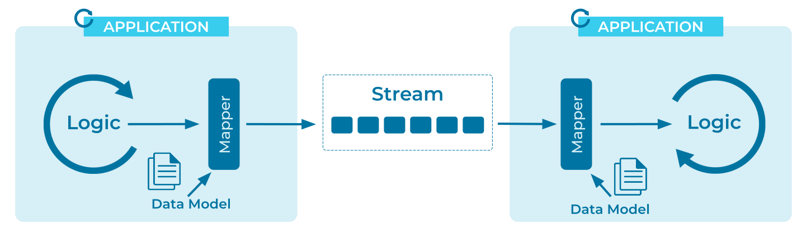

---
seo:
  title: Event Mapper
  description: How do we move data between domain objects and events in an event streaming platform?
---

# Event Mapper
Traditional applications (operating with data at rest) and [Event Processing Applications](event-processing-application.md) (with data in motion), may need to share data via the [Event Streaming Platform](../event-stream/event-streaming-platform.md). These applications will need a common mechanism to convert data from events to domain objects and vice versa.

## Problem
How do I move data between an application’s internal data model (with domain objects) and an event streaming platform (with events) while keeping the two independent of each other?

## Solution


Event Mappers provide independence between the application and the event streaming platform so that neither is aware of the other, and ideally not even of the event mapper itself.

Create (or use an existing) Event Mapper to map the [Domain Model](https://en.wikipedia.org/wiki/Domain_model) (or the application's internal data model) to the data formats accepted by the event streaming platform, and vice versa. The mapper reads the domain model and converts it into outgoing events that are sent to the event streaming platform. Conversely, a mapper can be used to create or update domain objects from incoming events.

## Implementation
In this example, we use Kafka's Java producer client to implement a Mapper that constructs an [Event](../event/event.md) (`PublicationEvent`) from the Domain Model (`Publication`) before the event is written to an [Event Stream](../event-stream/event-stream.md) a.k.a. topic in Kafka.

```java
private final IMapper domainToEventMapper = mapperFactory.buildMapper(Publication.class);
private final Producer<String, PublicationEvent> producer = ...

public void newPublication(String author, String title) {
  Publication newPub = new Publication(author, title);
  producer.send(author /* event key */, domainToEventMapper.map(newPub));
```

We can implement the reverse operation in a second Mapper that converts `PublicationEvent` instances back into Domain Object updates:
```java
private final IMapper eventToDomainMapper = mapperFactory.buildMapper(Publication.class);
private final Consumer<String, PublicationEvent> consumer = ...

public void updatePublication(PublicationEvent pubEvent) {
  Publication newPub = eventToDomainMapper.map(pubEvent);
  domainStore.update(newPub);
```

## Considerations

* The mapper may optionally validate the schema of the converted objects, see the [Schema Validator](../event-source/schema-validator.md) pattern.


## References
* Related patterns: [Event Serializer](../event/event-serializer.md) and [Event Deserializer](../event/event-deserializer.md)
* This pattern is derived from [Messaging Mapper](https://www.enterpriseintegrationpatterns.com/patterns/messaging/MessagingMapper.html) in Enterprise Integration Patterns by Gregor Hohpe and Bobby Woolf
