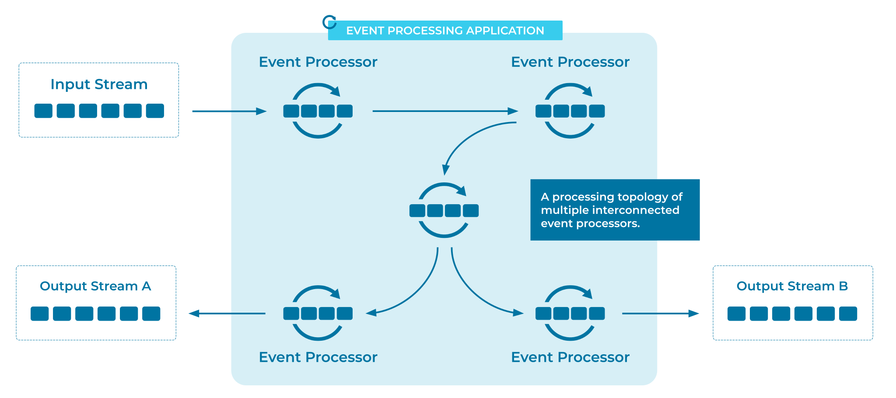

---
seo:
  title: Event Processing Application
  description: An Event Processing Application is composed of one or more connected Event Processors, which form a processing topology to continuously process data in Event Streams and Tables.
---

# Event Processing Application
Once our data -- such as financial transactions, tracking information for shipments, IoT sensor measurements, etc. -- is set in motion as streams of events on an Event Streaming Platform, we want to put that data to use and create value from it. [Event Processors](../event-processing/event-processor.md) are the building blocks for achieving this, but they solve only a specific part or step of a use case.

## Problem
How can we build a full-fledged application for data in motion, an application that creates, reads, processes, and/or queries [Event Streams](../event-stream/event-stream.md) to solve a use case end-to-end?

## Solution


We build an Event Processing Application by composing one or more [Event Processors](../event-processing/event-processor.md) into an interconnected processing topology for [Event Streams](../event-stream/event-stream.md) and [Tables](../table/state-table.md). Here, the continuous output streams of one processor are the continuous input streams to one or more downstream processors. The combined functionality of the application then covers our use case end-to-end, or at least covers as much of the use case as we want. (The question of how many applications should implement a use case is an important design decision, which we are not covering here.) The event processors -- which make up the larger Event Processing Application -- are typically distributed, running across multiple instances, to allow for elastic, parallel, fault-tolerant processing of data in motion at scale.

For example, an application can read a stream of customer payments from an [Event Store](../event-storage/event-store.md) in an [Event Streaming Platform](../event-stream/event-streaming-platform.md), then filter payments for certain customers, and then aggregate those payments per country and per week. The processing mode is stream processing; that is, data is continuously processed 24/7. As soon as new [Events](../event/event.md) are available, they are processed and propagated through the topology of [Event Processors](../event-processing/event-processor.md).


## Implementation
Apache Kafka® is the most popular [Event Streaming Platform](../event-stream/event-streaming-platform.md). There are several options for building Event Processing Applications when using Kafka. We'll cover two here.

### ksqlDB
[ksqlDB](https://ksqldb.io) is a streaming database with which we can build Event Processing Applications using SQL syntax. It has first-class support for [Streams](../event-stream/event-stream.md) and [Tables](../table/state-table.md).

When we create [Tables](../table/state-table.md) and [Streams](../event-stream/event-stream.md) in ksqlDB, Kafka topics are used as the storage layer behind the scenes. In the example below, the ksqlDB table `movies` is backed by a Kafka topic of the same name.
```sql
CREATE TABLE movies (ID INT PRIMARY KEY, title VARCHAR, release_year INT)
    WITH (kafka_topic='movies', partitions=1, value_format='avro');
CREATE STREAM ratings (MOVIE_ID INT KEY, rating DOUBLE)
    WITH (kafka_topic='ratings', partitions=1, value_format='avro');
```

As we would expect, we can add new [Events](../event/event.md) using `INSERT`:
```sql
INSERT INTO movies (id, title, release_year) VALUES (294, 'Die Hard', 1998);
INSERT INTO ratings (movie_id, rating) VALUES (294, 8.2);
```

We can also perform stream processing using ksqlDB's SQL syntax. In the following example, the command `CREATE STREAM .. AS SELECT ..` continuously joins the `ratings` stream and the `movies` table to create a new stream of enriched ratings.
```sql
CREATE STREAM rated_movies
    WITH (kafka_topic='rated_movies',
          value_format='avro') AS
    SELECT ratings.movie_id as id, title, rating
    FROM ratings
    LEFT JOIN movies ON ratings.movie_id = movies.id;
```

### Kafka Streams

With the [Kafka Streams client library](https://docs.confluent.io/platform/current/streams/index.html) of Apache Kafka, we can implement an event processing application in Java, Scala, or other JVM languages. Here is a Kafka Streams example similar to the ksqlDB example above:

```java
KStream<Integer, Rating> ratings = builder.table(<blabla>);
KTable<Integer, Movie> movies = builder.stream(<blabla>);
MovieRatingJoiner joiner = new MovieRatingJoiner();
KStream <Integer, EnrichedRating> enrichedRatings = ratings.join(movies, joiner);
```

See the tutorial [How to join a stream and a lookup table](https://kafka-tutorials.confluent.io/join-a-stream-to-a-table/kstreams.html) for a full example of using Kafka Streams to build an Event Processing Application.

## Considerations
* When building an Event Processing Application, it's recommended to confine the application to one problem domain. While it's possible to use any number of Event Processors in the application, the Event Processors should be closely related in most cases (similar to how one would design a microservice).
* Event Processing Applications themselves can also be composed. This is a common design pattern for implementing event-driven architectures, which are powered by a fleet of applications and microservices. In this design, the output of one application forms the input to one or more downstream applications. This is conceptually similar to the topology of [Event Processors](../event-processing/event-processor.md), as described above. A key difference in practice, however, is that different applications are often built by different teams inside an organization. For example, a customer-facing application built by the Payments team is continuously feeding data via [Event Streams](../event-stream/event-stream.md) to an application built by the Anti-Fraud team, and to another application built by the Data Science team. 

## References
* The [Event Streaming Platform](../event-stream/event-streaming-platform.md) pattern provides a higher-level overview of how Event Processing Applications are used across the Event Streaming Platform.
* The tutorial [How to join a stream and a lookup table](https://kafka-tutorials.confluent.io/join-a-stream-to-a-table/ksql.html) provides a step-by-step example of event processing using SQL.
* The tutorial [How to sum a stream of events](https://kafka-tutorials.confluent.io/create-stateful-aggregation-sum/ksql.html) shows how to apply an aggregate function over an [Event Stream](../event-stream/event-stream.md). 
