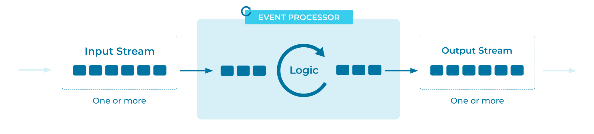

---
seo:
  title: Event Processor
  description: An Event Processor applies a specific processing operation to an event. Event Processors are typically used and composed by larger Event Processing Applications. 
---

# Event Processor
Once our data -- such as financial transactions, tracking information for shipments, IoT sensor measurements, etc. -- is set in motion as [streams of events](../event-stream/event-stream.md) on an [Event Streaming Platform](../event-stream/event-streaming-platform.md), we want to put it to use and create value from it. How do we do this?

## Problem
How can we process [Events](../event/event.md) in an [Event Streaming Platform](../event-stream/event-streaming-platform.md)?

## Solution

We build an Event Processor, which is a component that reads [Events](../event/event.md) and processes them, possibly writing new Events as the result of its processing. An Event Processor may act as an [Event Source](../event-source/event-source.md) and/or [Event Sink](../event-sink/event-sink.md); in practice, both are common. An Event Processor can be distributed, which means that it has multiple instances running across different machines. In this case, the processing of Events happens concurrently across these instances.

An important characteristic of an Event Processor is that it should allow for composition with other Event Processors. In practice, we rarely use a single Event Processor in isolation. Instead, we compose and connect one or more Event Processors (via [Event Streams](../event-stream/event-stream.md)) inside an [Event Processing Application](event-processing-application.md) that fully implements one particular use case end-to-end, or that implements a subset of the overall business logic limited to the bounded context of a particular domain (for example, in a microservices architecture). 

An Event Processor performs a specific task within the Event Processing Application. Think of the Event Processor as one processing node, or processing step, of a larger processing topology. Examples are the mapping of an event type to a domain object, filtering only the important events out of an [Event Stream](../event-stream/event-stream.md), enriching an event stream with additional data by joining it to another stream or database table, triggering alerts, or creating new events for consumption by other applications.

## Implementation

There are multiple ways to create an [Event Processing Application](../event-processing/event-processing-application.md) using Event Processors. We will look at two.

#### ksqlDB
The streaming database [ksqlDB](https://ksqldb.io) provides a familiar SQL syntax, which we can use to create Event Processing Applications. ksqlDB parses SQL commands and constructs and manages the Event Processors that we define as part of an Event Processing Application.

In the following example, we create a ksqlDB query that reads data from the `readings` Event Stream and "cleans" the Event values. The query publishes the clean readings to a new stream called `clean_readings`. Here, this query acts as an event processing application comprising multiple interconnected Event Processors.

```sql
CREATE STREAM clean_readings AS
    SELECT sensor,
           reading,
           UCASE(location) AS location
    FROM readings
    EMIT CHANGES;
```

With ksqlDB, we can view each section of the command as the construction of a different Event Processor:

* `CREATE STREAM` defines the new output [Event Stream](../event-stream/event-stream.md) to which this application will produce Events.
* `SELECT ...` is a mapping function, taking each input Event and "cleaning" it as defined. In this example, cleaning simply means uppercasing the `location` field in each input reading.
* `FROM ...` is a source Event Processor that defines the input Event Stream for the overall application.
* `EMIT CHANGES` is ksqlDB syntax that defines our query as continuously running, and specifies that incremental changes will be produced as the query runs perpetually.

#### Kafka Streams
The [Kafka Streams DSL](https://docs.confluent.io/platform/current/streams/developer-guide/dsl-api.html) provides abstractions for [Event Streams](../event-stream/event-stream.md) and [Tables](../table/state-table.md), as well as stateful and stateless transformation functions (`map`, `filter`, and others). Each of these functions can act as an Event Processor in the larger [Event Processing Application](../event-processing/event-processing-application.md) that we build with the Kafka Streams library.

```java
builder
  .stream("readings");
  .mapValues((key, value)-> 
    new Reading(value.sensor, value.reading, value.location.toUpperCase()) 
  .to("clean");
```

In the above example, we use the [Kafka Streams `StreamsBuilder`](https://kafka.apache.org/28/javadoc/org/apache/kafka/streams/StreamsBuilder.html) to construct the stream processing topology. 

* First, we create an input stream, using the `stream` function. This creates an Event Stream from the designated Apache Kafka&reg; topic.
* Next, we transform the Events, using the `mapValues` function. This function accepts an Event and returns a new Event with any desired transformations to the original Event's values.
* Finally, we write the transformed Events to a destination Kafka topic, using the `to` function. This function terminates our stream processing topology.

## Considerations

* While it could be tempting to build a "multi-purpose" Event Processor, it's important to design processors in a composable way. By building processors as discrete units, it is easier to reason about what each processor does, and by extension, what the Event Processing Application does. 

## References
* See the [Event Processing Application](../event-processing/event-processor.md) pattern. Event Processing Applications are composed of Event Processors.
* In [Kafka Streams](https://kafka.apache.org/28/documentation/streams/core-concepts#streams_topology), a processor is a node in the processor topology, representing a step to transform Events.
* See the blog post [How Real-Time Stream Processing Works with ksqlDB, Animated](https://www.confluent.io/blog/how-real-time-stream-processing-works-with-ksqldb/).
* The blog post [Intro to Apache Kafka: How Kafka Works](https://www.confluent.io/blog/apache-kafka-intro-how-kafka-works/) provides details about the core Kafka concepts, such as Events and topics.
