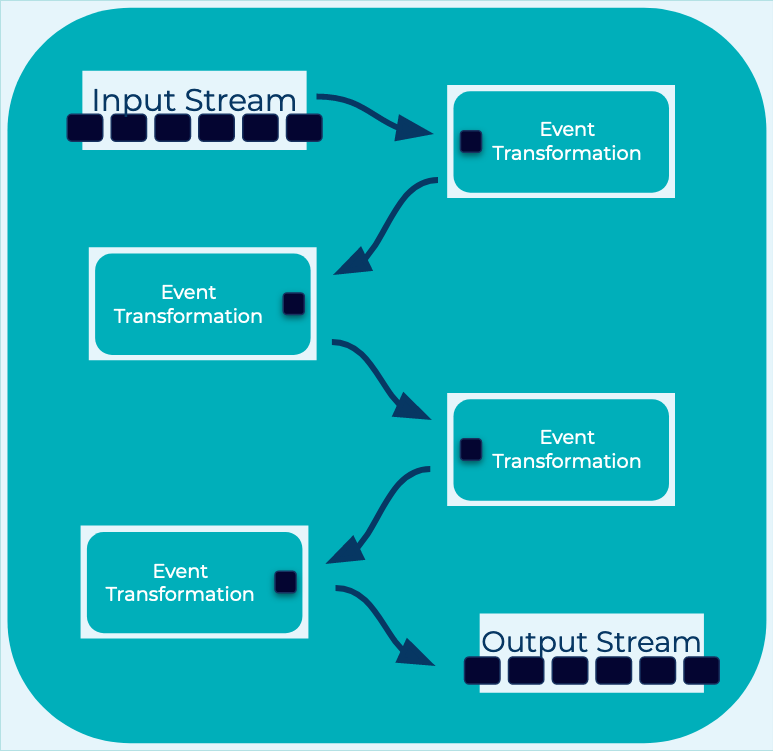

---
seo:
  title: Event Processor
  description: Event Processors apply a specific processing operation on an event, and are typically used and composed by larger Event Processing Applications. 
---

# Event Processor
Once data such as financial transactions, tracking information for shipments, IoT sensor measurements, etc. is set in motion as [streams of events](../event-stream/event-stream.md) on an [Event Streaming Platform](../event-stream/event-streaming-platform.md), we want to put it to use and create value from it. How do we do this?

## Problem
How do we process [Events](../event/event.md) in an [Event Streaming Platform](../event-stream/event-streaming-platform.md)? For example, how can I process financial transactions, track shipments, analyze IoT sensors data, or generate continuous intelligence?

## Solution

We build an Event Processor, which is a component that reads [Events](../event/event.md) and processes them, and possibly writes new [Events](../event/event.md) as the result of its processing. As such, it may act as an [Event Source](../event-source/event-source) and/or [Event Sink](../event-sink/event-sink.md), and in practice often acts as both. An event processor can be distributed, which means it has multiple instances that run across different machines. In this case the processing of [Events](../event/event.md) happens concurrently across these instances.

An important characteristic of an event processor is that it should allow for composition with other event processors. That's because, in practice, we rarely use a single event processor in isolation. Instead, we compose and connect (via [Event Streams](../event-stream/event-stream.md)) one or more event processors inside an [Event Processing Application](event-processing-application.md) that fully implements one particular use case end-to-end, or (e.g., in the case of microservices) that implements a subset of the overall business logic limited to the bounded context of a particular domain. 

An event processor performs a specific task within the event processing application. You can think of it as one processing node (or processing step) of a larger processing topology. Examples are the mapping of an event type to a domain object, filtering only the important events out of an [Event Stream](todo: link pattern), enriching an event stream with additional data by joining it to another stream or database table, triggering alerts, or creating new events for consumption by other applications.

## Implementation

There are multiple ways to create an [Event Processing Application](../event-processing/event-processing-application.md) using Event Processors, we will look at two.

#### ksqlDB
[ksqlDB](https://ksqldb.io) provides a familiar `SQL` syntax that allows you to create [Event Processing Applications](../event-processing/event-processing-application.md). ksqlDB takes parses SQL commands and constructs and manages the Event Processors you define as part of your [Event Processing Application](../event-processing/event-processing-application.md).

In the following example ksqlDB is reading values into the application from the `readings` [Event Stream](../event-stream/event-stream.md) and "cleaning" the [Event](../event/event.md) values. ksqlDB is publishing the "clean" readings to an [Event Stream](../event-stream/event-stream.md) named `clean_readings`.

```sql
CREATE STREAM clean_readings AS
    SELECT sensor,
           reading,
           UCASE(location) AS location
    FROM readings
    EMIT CHANGES;
```

With ksqlDB, you can view each section of the command as the construction of a different Event Processor:

* `CREATE STREAM` defines the new output [Event Stream](../event-stream/event-stream.md) that this application will produce [Events](../event/event.md) to.
* `SELECT ...` is a mapping function, taking each input [Event](../event/event.md) and converting it as defined. In this example, raising the case of the `location` field in each input reading.
* `FROM ...` is an source Event Processor that defines the input [Event Stream](../event-stream/event-stream.md) for the application.
* `EMIT CHANGES` is ksqlDB syntax which defines our query as continuous, and that incremental changes will be produced as the application runs perpetually.

#### Kafka Streams

!! Work in progress...

```java
builder
  .stream("readings");
  .mapValues((key, value)-> 
    new Reading(value.sensor, value.reading, value.location.toUpperCase()) 
  .to("clean");
```

## Considerations

* While it could be tempting to build a "multi-purpose" event processor, it's important that processor performs a discrete, idempotent action.  By building processors this way, it's easier to reason about what each processor does and by extension what the [Event Processing Application](../event-processing/event-processing-application.md) does. 


## References
* [Event Processing Applications](../event-processing/event-processing.md) are componsed of Event Processors.
* In [Kafka Streams](https://kafka.apache.org/28/documentation/streams/core-concepts#streams_topology), a processor is a node in the processor topology representing a step to transform [Events](../event/event.md).
* Blog post: [How real-time stream processing works with ksqlDB, Animated](https://www.confluent.io/blog/how-real-time-stream-processing-works-with-ksqldb/).
