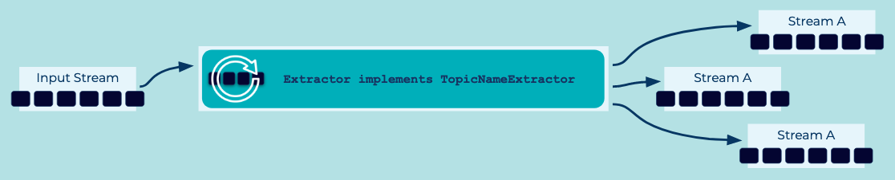

---
seo:
   title: Event Router
   description: Event Routers are used to route Events to different Event Streams based on data or metadata values contained in each Event. 
---

# Event Router
[Event Streams](../event-stream/event-stream.md) may contain a subset of [Events](../event/event.md) which need to be processed in isolation. For example, an inventory check system may be distributed across multiple physical systems, and the target system depends on the category of the item being checked. [Event Stream Processors](../event-processing/event-processor.md) can also be optimized when processing [Event Streams](../event-stream/event-stream.md) which contain focused data as they are free from filtering of streams with irrelevant data. Additionally, there may be a desire to do crosscutting data processing where isolating [Events](../event/event.md) will allow for a cleaner separation of concerns. 

## Problem
How can we isolate [Events](../event/event.md) into a dedicated [Event Stream](../event-stream/event-stream.md) based on some attribute of the [Events](../event/event.md)?

## Solution


## Implementation
With [ksqlDB](https://ksqldb.io/), you can continuously route events to a different stream using the `CREATE STREAM` syntax with an appropriate `WHERE` filter.

```
CREATE STREAM actingevents_drama AS
    SELECT NAME, TITLE
      FROM ACTINGEVENTS
      WHERE GENRE='drama';

CREATE STREAM actingevents_fantasy AS
    SELECT NAME, TITLE
      FROM ACTINGEVENTS
      WHERE GENRE='fantasy';
```

With the [Kafka Streams library](https://kafka.apache.org/documentation/streams/), use a [TopicNameExtractor](https://kafka.apache.org/28/javadoc/org/apache/kafka/streams/processor/TopicNameExtractor.html) to route events to different streams (topics).  The `TopicNameExtractor` has one method to implement, `extract()`, which accepts three parameters:

- The event key
- The event value
- The [RecordContext](https://kafka.apache.org/28/javadoc/org/apache/kafka/streams/processor/RecordContext.html, which provides access to headers, partitions, and other contextual information about the event.

You can use any of the given parameters to generate and return the desired destination topic name for the given event, and Kafka Streams will complete the routing. 

```
GenreTopicExtractor implements TopicNameExtractor<String, String> {
   String extract(String key, String value, RecordContext recordContext) {
      switch (value.genre) {
        case "drama":
          return "drama-topic";
        case "fantasy":
          return "fantasy-topic";
      }
   }
}

KStream<String, String> myStream = builder.stream(...);
myStream.mapValues(..).to(new GenreTopicExtractor());
```

## Considerations
* Event Routers should not modify the Event itself and instead only provide the proper routing to the desired destinations.
* Consider the use of an [Event Envelope](TODO: pattern link) if an event router should attach additional information or context to an event.

## References
* This pattern is derived from [Message Router](https://www.enterpriseintegrationpatterns.com/patterns/messaging/MessageRouter.html) in Enterprise Integration Patterns by Gregor Hohpe and Bobby Woolf
* See the tutorial [How to dynamically choose the output topic at runtime](https://kafka-tutorials.confluent.io/dynamic-output-topic/kstreams.html) for a full example of dynamically routing events at runtime.
