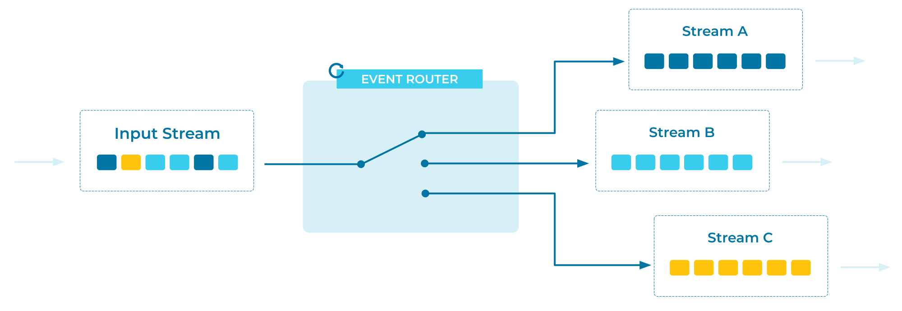

---
seo:
   title: Event Router
   description: Event Routers are used to route Events to different Event Streams based on data or metadata values contained in each Event. 
---

# Event Router
[Event Streams](../event-stream/event-stream.md) may contain a subset of [Events](../event/event.md) which need to be processed in isolation. For example, an inventory check system may be distributed across multiple physical systems, and the target system may depend on the category of the item being checked. 

## Problem
How can we isolate [Events](../event/event.md) into a dedicated [Event Stream](../event-stream/event-stream.md) based on an attribute of the Events?

## Solution


## Implementation
As an example, with [Apache Flink® SQL](https://nightlies.apache.org/flink/flink-docs-stable/docs/dev/table/sql/gettingstarted/), we can continuously route Events to a different Event Stream using `CREATE TABLE AS SELECT` (CTAS) syntax:

```
CREATE TABLE payments ...;

CREATE TABLE payments_france AS
    SELECT * FROM payments WHERE country = 'france';

CREATE TABLE payments_spain AS
    SELECT * FROM payments WHERE country = 'spain';
```

With the Apache Kafka® client library [Kafka Streams](https://kafka.apache.org/documentation/streams/), use a [`TopicNameExtractor`](https://kafka.apache.org/38/javadoc/org/apache/kafka/streams/processor/TopicNameExtractor.html) to route Events to different Event Streams (called "topics" in Kafka).  The `TopicNameExtractor` has one method to implement, `extract()`, which accepts three parameters:

- The event key
- The event value
- The [`RecordContext`](https://kafka.apache.org/38/javadoc/org/apache/kafka/streams/processor/RecordContext.html), which provides access to headers, partitions, and other contextual information about the event

We can use any of the given parameters to generate and return the desired destination topic name for the given Event. Kafka Streams will complete the routing. 

```java
CountryTopicExtractor implements TopicNameExtractor<String, String> {
   String extract(String key, String value, RecordContext recordContext) {
      switch (value.country) {
        case "france":
          return "france-topic";
        case "spain":
          return "spain-topic";
      }
   }
}

KStream<String, String> myStream = builder.stream(...);
myStream.mapValues(..).to(new CountryTopicExtractor());
```

## Considerations
* Event Routers should not modify the Event itself, and instead should provide only proper routing to the desired destinations.
* If an Event Router needs to attach additional information or context to an Event, consider using the [Event Envelope](../event/event-envelope.md) pattern.

## References
* This pattern is derived from [Message Router](https://www.enterpriseintegrationpatterns.com/patterns/messaging/MessageRouter.html) in _Enterprise Integration Patterns_, by Gregor Hohpe and Bobby Woolf.
* See the tutorial [How to dynamically choose the output topic at runtime](https://developer.confluent.io/confluent-tutorials/dynamic-output-topic/kstreams/) for a full example of dynamically routing Events at runtime.
