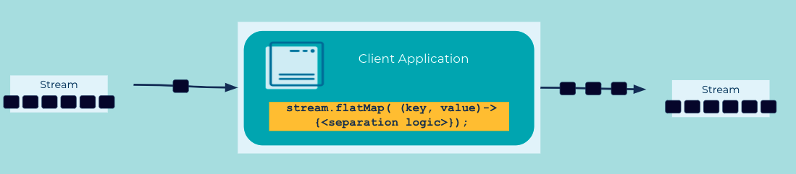

---
seo:
  title: Event Splitter
  description: Split an event into multiple events so that they can be processed in a different ways
---

# Event Splitter
One [Event](../event/event.md) may actually contain multiple child events within it, each of which may need to be processed in different ways.

## Problem
How can an [Event](../event/event.md) be split into multiple events?

## Solution

First, split the original event into multiple child events.
Then, publish one event per child.

## Implementation
Many event processing technologies support this operation.
ksqlDB has the `EXPLODE()` table function which takes an array and outputs one value for each of the elements of the array.
The example below processes each input event, un-nesting the array and generating new events for each element with new column names.

```
SELECT EXPLODE(TOTAL)->TOTALTYPE AS TOTAL_TYPE,
             EXPLODE(TOTAL)->TOTALAMOUNT AS TOTAL_AMOUNT,
             EXPLODE(TOTAL)->ID AS CUSTOMER_ID
        FROM my_stream EMIT CHANGES;
```

Kafka Streams has an analogous method called `flatMap()`.
The example below processes each input event, generating new events with new keys and values.

```java
KStream<Long, String> myStream = ...;
KStream<String, Integer> splitStream = myStream.flatMap(
    (eventKey, eventValue) -> {
      List<KeyValue<String, Integer>> result = new LinkedList<>();
      result.add(KeyValue.pair(eventValue.toUpperCase(), 1000));
      result.add(KeyValue.pair(eventValue.toLowerCase(), 9000));
      return result;
    }
  );
```

Or as my grandmother used to say:

> _There once was a man from Manhattan,_  
> _With Events that he needed to flatten,_  
> _He cooked up a scheme,_  
> _To call `flapMap` on `stream`,_  
> _Then he wrote it all down as a pattern._

## Considerations
* If child events need to be routed to different streams, see [Event Router](../event-processing/event-router.md) for routing events to different locations.
* Capacity planning and sizing: splitting the original event into N child events leads to write amplification, thereby increasing the volume of events that must be managed by the event streaming platform.
* Event Lineage: a use case may require tracking the lineage of parent and child events. If so, ensure that the child events include a data field containing a reference to the original parent event, e.g. a unique identifier.

## References
* This pattern is derived from [Splitter](https://www.enterpriseintegrationpatterns.com/patterns/messaging/Sequencer.html) in Enterprise Integration Patterns by Gregor Hohpe and Bobby Woolf
