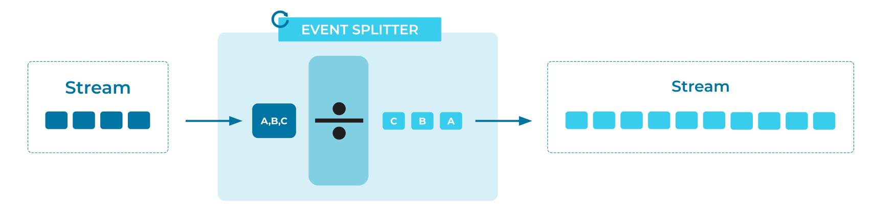

---
seo:
  title: Event Splitter
  description: An Event Splitter splits an Event into multiple Events that can each be processed in different ways.
---

# Event Splitter
One [Event](../event/event.md) may actually contain multiple child Events, each of which may need to be processed in a different way.

## Problem
How can an [Event](../event/event.md) be split into multiple Events for distinct processing?

## Solution

Split the original Event into multiple child Events.
Then publish one Event for each of the child Events.

## Implementation
Many event processing technologies support this operation. [Apache Flink® SQL](https://nightlies.apache.org/flink/flink-docs-stable/docs/dev/table/sql/gettingstarted/) supports expanding an array into multiple events via the `UNNEST` function. The example below processes each input Event, un-nesting the array and generating new Events for each element.

```sql
CREATE TABLE orders (
    order_id INT NOT NULL,
    tags ARRAY<STRING>
);
```

```sql
CREATE TABLE exploded_orders AS
  SELECT order_id, tag
  FROM orders
  CROSS JOIN UNNEST(tags) AS t (tag);
```

The Apache Kafka® client library [Kafka Streams](https://kafka.apache.org/documentation/streams/) has an analogous method, called `flatMap()`.
The example below processes each input Event and generates new Events, with new keys and values.

```java
KStream<Long, String> myStream = ...;
KStream<String, Integer> splitStream = myStream.flatMap(
    (eventKey, eventValue) -> {
      List<KeyValue<String, Integer>> result = new LinkedList<>();
      result.add(KeyValue.pair(eventValue.toUpperCase(), 1000));
      result.add(KeyValue.pair(eventValue.toLowerCase(), 9000));
      return result;
    }
  );
```

Or, as my grandmother used to say:

> _There once was a man from Manhattan,_  
> _With Events that he needed to flatten._  
> _He cooked up a scheme_  
> _To call `flatMap` on `stream`,_  
> _Then he wrote it all down as a pattern._

## Considerations
* If you have child Events that must be routed to different Event Streams, see the [Event Router](../event-processing/event-router.md) pattern, used to route Events to different locations.
* For capacity planning and sizing, consider that splitting the original Event into N child Events leads to write amplification, increasing the volume of Events that must be managed by the [Event Streaming Platform](../event-stream/event-streaming-platform.md).
* A use case may require that you track the lineage of parent and child Events. If so, ensure that the child Events include a data field containing a reference to the original parent Event (for example, a unique identifier).

## References
* This pattern is derived from [Splitter](https://www.enterpriseintegrationpatterns.com/patterns/messaging/Sequencer.html) in _Enterprise Integration Patterns_, by Gregor Hohpe and Bobby Woolf.
