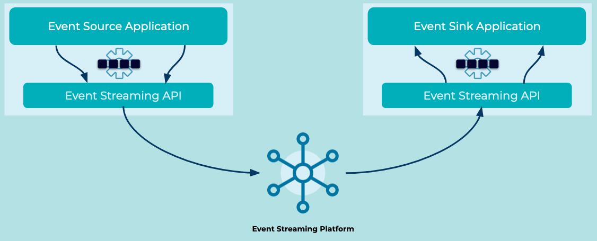

---
seo:
  title: Event Streaming API
  description: An Event Streaming API gives applications a consistent and reliable way to connect to an Event Streaming Platform.
---

# Event Streaming API
Applications that connect to the [Event Streaming Platform](../event-stream/event-streaming-platform.md) need to do so in a consistent and reliable way. 

## Problem
How can my application connect to an Event Streaming Platform to send and receive [Events](../event/event.md)?

## Solution

The Event Streaming Platform provides an Application Programming Interface (API) that allows applications to reliably communicate across the platform. The API provides a logical and well-documented protocol, which defines the message structure and data exchange methods. Higher-level libraries implement these protocols, so that a variety of technologies and programming languages can be used to interface with the platform. These higher-level libraries allow the application to focus on business logic and leave the details of platform communication to the API.

## References
* This pattern is derived from [Message Endpoint](https://www.enterpriseintegrationpatterns.com/patterns/messaging/MessageEndpoint.html) in _Enterprise Integration Patterns_, by Gregor Hohpe and Bobby Woolf.
* The [Kafka Protocol Guide](https://kafka.apache.org/protocol.html) provides details about the wire protocol implemented in Kafka.
* The [Kafka API documentation](https://kafka.apache.org/documentation/#api) contains information about the variety of APIs available for reading from, writing to, and administering Kafka.
