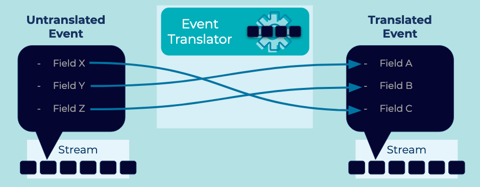

---
seo:
  title: Event Translator
  description: An Event Translator allows systems using different data formats to communicate via Events.
---

# Event Translator
[Event Streaming Platforms](../event-stream/event-streaming-platform.md) will connect a variety of systems over time, and it may not be feasible to use common data formats across all of these systems.

## Problem
How can systems that use different data formats communicate with each other via [Events](../event/event.md)?

## Solution


An Event Translator converts a data format into a standard format that is familiar to downstream [Event Processors](../event-processing/event-processor.md). This can take the form of field manipulation -- for example, mapping one Event schema to another Event schema. Another common form is different serialization types -- for example, translating Apache Avro&trade; to JSON or Protocol Buffers (Protobuf) to Avro.

## Implementation
With the streaming database [ksqlDB](https://ksqldb.io), we can create [Event Streams](../event-stream/event-stream.md) using SQL statements:

```
CREATE STREAM translated_stream AS
   SELECT
      fieldX AS fieldC,
      field.Y AS fieldA,
      field.Z AS fieldB
   FROM untranslated_stream
```

## Considerations
- In some cases, translations will be unidirectional if data is lost. For example, translating XML to JSON will often lose information, meaning that the original form cannot be recreated. 

## References
* This pattern is derived from [Event Translator](https://www.enterpriseintegrationpatterns.com/patterns/messaging/MessageTranslator.html) in _Enterprise Integration Patterns_, by Gregor Hohpe and Bobby Woolf.
