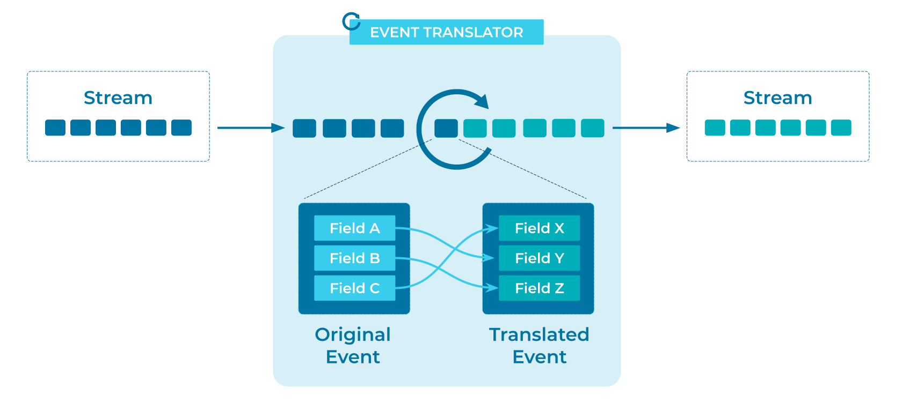

# Event Translator
[Event Streaming Platforms](../event-stream/event-streaming-platform.md) will connect a variety of systems over time, and common data formats may not be feasible across them.

## Problem
How can systems using different data formats communicate with each other using [Events](../event/event.md)?

## Solution


An Event Translator converts a data format into a standard format familiar to downstream [Event Processors](../event-processing/event-processor.md). This can take the form of field manipulation, for example mapping one event schema (ref) to another event schema. Another common form is different serialization types, for example, translating Avro to JSON or Protobuf to Avro.

## Implementation
The streaming database [ksqlDB](https://ksqldb.io) provides the ability to create [Event Streams](../event-stream/event-stream.md) with SQL statements.

```
CREATE STREAM translated_stream AS
   SELECT
      fieldX AS fieldC,
      field.Y AS fieldA,
      field.Z AS fieldB
   FROM untranslated_stream
```

## Considerations
- In some cases translations will be unidirectional if data is lost, for example translating XML to JSON will often lose information meaning the original form cannot be recreated. 

## References
* This pattern is derived from [Event Translator](https://www.enterpriseintegrationpatterns.com/patterns/messaging/MessageTranslator.html) in Enterprise Integration Patterns by Gregor Hohpe and Bobby Woolf
