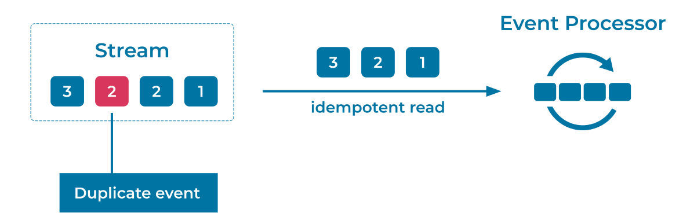

---
seo:
  title: Idempotent Reader
  description: An Idempotent Reader consumes the same event once or multiple times, with the same effect.
---

# Idempotent Reader

In ideal circumstances, [Events](../event/event.md) are only written once into an [Event Stream](../event-stream/event-stream.md). Under normal operations, all consumers of the stream will also only read and process each event once. However, depending on the behavior and configuration of the [Event Source](../event-source/event-source.md), there may be failures that create duplicate events. When this happens, we need a strategy for dealing with the duplicates.

An [idempotent](https://en.wikipedia.org/wiki/Idempotence) reader must take two causes of duplicate events into consideration:

1. *Operational Failures*: Intermittent network and system failures are unavoidable in distributed systems. In the case of a machine failure or a brief network outage, an [Event Source](../event-source/event-source.md) may produce the same event multiple times due to retries. Similarly, an [Event Sink](../event-sink/event-sink.md) may consume and process the same event multiple times due to intermittent offset updating failures. The [Event Streaming Platform](../event-stream/event-streaming-platform.md) should automatically guard against these operational failures by providing strong delivery and processing guarantees, such as those found in Apache Kafka® transactions.

2. *Incorrect Application Logic*: An [Event Source](../event-source/event-source.md) could mistakenly produce the same event multiple times, populating the [Event Stream](../event-stream/event-stream.md) with multiple distinct events from the perspective of the [Event Streaming Platform](../event-stream/event-streaming-platform.md). For example, imagine a bug in the Event Source that writes a customer payment event twice, instead of just once. The Event Streaming Platform knows nothing of the business logic, so it cannot differentiate between the two events and instead considers them as two distinct payment events.

## Problem
How can an application deal with duplicate Events when reading from an Event Stream?

## Solution


This can be addressed using exactly-once semantics (EOS), including native support for transactions and support for idempotent clients.
EOS allows [Event Streaming Applications](../event-processing/event-processing-application.md) to process data without loss or duplication, ensuring that computed results are always accurate. 

[Idempotent Writing](idempotent-writer.md) by the [Event Source](../event-source/event-source.md) is the first step in solving this problem. Idempotent Writing provides strong, exactly-once delivery guarantees of the producer's Events, and removes operational failures as a cause of written duplicate Events.

On the reading side, in [Event Processors](../event-processing/event-processor.md) and [Event Sinks](../event-sink/event-sink.md), an Idempotent Reader can be configured to read only committed transactions. This prevents events within incomplete transactions from being read, providing the reader isolation from operational writer failures. Keep in mind that idempotence means that the reader's business logic must be able to process the same consumed event multiple times, where multiple reads have the same effect as a single read of the event. For example, if the reader manages a counter (i.e., a state) for the events it has read, then reading the same event multiple times should only increment the counter once.

Duplicates caused by incorrect application logic from upstream sources are best resolved by fixing the application's logic (i.e., fixing the root cause). In cases where this is not possible, such as when events are generated outside of our control, the next best option is to tag duplicate events with tracking IDs. A tracking ID should be a field that is unique to the logical event, such as an event key or request ID. The consumer can then read the tracking ID, cross-reference it against an internal state store of IDs it has already processed, and discard the event if necessary.


## Implementation
To handle operational failures, you can [enable EOS in your Kafka Streams application](https://www.confluent.io/blog/enabling-exactly-once-kafka-streams/). A Streams application using EOS will atomically update its consumer offsets, state store changelog topics, reparition topics, and output topics within a single transaction.

In the streaming database [ksqlDB](https://ksqldb.io), you can [enable EOS](https://docs.ksqldb.io/en/latest/operate-and-deploy/exactly-once-semantics/#exactly-once-semantics) similarly, with the following setting:

```
processing.guarantee="exactly_once"
``` 

To handle incorrect application logic, again, first try to eliminate the source of duplication from the code. If that is not an option, you can assign a tracking ID to each event based off of the contents of the event, enabling consumers to detect duplicates for themselves. This requires that each consumer application maintain an internal state store for tracking the events' unique IDs, and this store will vary in size depending on the event count and the period for which the consumer must guard against duplicates. This option requires both additional disk usage and processing power for inserting and validating events.

For a subset of business cases, it may also be possible to design the consumer processing logic to be idempotent. For example, in a simple ETL where a database is the [Event Sink](../event-sink/event-sink.md), the duplicate events can be deduplicated by the database during an `upsert` on the event ID as primary key. Idempotent business logic also enables your application to read from [Event Streams](../event-stream/event-stream.md) that aren't strictly free of duplicates, or from historic streams that may not have had EOS available when they were created.

## Considerations
A solution that requires EOS guarantees must enable EOS at all stages of the pipeline, not just on the reader. An Idempotent Reader is therefore typically combined with an [Idempotent Writer](../event-processing/idempotent-writer.md) and transactional processing.

## References
* This pattern is derived from [Idempotent Receiver](https://www.enterpriseintegrationpatterns.com/patterns/messaging/IdempotentReceiver.html) in _Enterprise Integration Patterns_, by Gregor Hohpe and Bobby Woolf.
* Blog post about [exactly-once semantics in Apache Kafka](https://www.confluent.io/blog/simplified-robust-exactly-one-semantics-in-kafka-2-5/)
* Tutorial on [How to maintain message ordering and no message duplication](https://kafka-tutorials.confluent.io/message-ordering/kafka.html)
