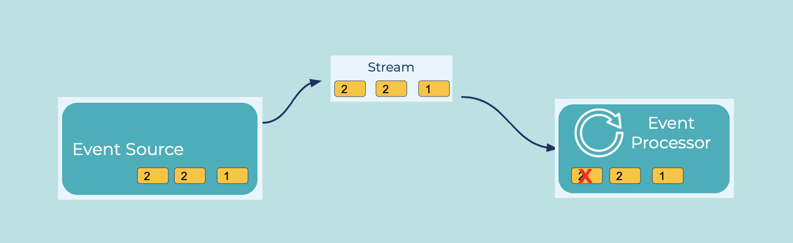

---
seo:
  title: Idempotent Reader
  description: An idempotent reader can consume the same event once or multiple times, and it will have the same effect.
---

# Idempotent Reader
Generally speaking, we want to believe that [Events](../event/event.md) get written into an [Event Streaming Platform](../event-stream/event-streaming-platform.md) once and read from it once, and that we don't need to handle multiple occurrences of published events.
However, depending on how the [Event Source](../event-source/event-source.md) is configured and what failures happen, we do need to think about potential duplicates.
There are two types of duplicates:

1. True single event: due to a failure, a writer could produce the same event twice or a reader could consume the same event twice
2. True duplicate events: an [Event Source](../event-source/event-source.md) could mistakenly produce the same event multiple times, which become true multiple distinct events in an [Event Stream](../event-stream/event-stream.md) from the perspective of the [Event Streaming Platform](../event-stream/event-streaming-platform.md)

## Problem
How can an application deal with duplicate events?

## Solution

Duplicates should ideally be prevented from being written more than once into the [Event Streaming Platform](../event-stream/event-streaming-platform.md), which can be done on the writer side with strong exactly-once semantics (EOS).
EOS is a framework that allows [Event Streaming Applications](../event-processing/event-processing-application.md) to process data without loss or duplication, which ensures that computed results are always accurate. 

However, if the Event Source is still capable of duplicating the same logical event, the consumer application will need to track unique IDs within each event.
The ID could be the event key or a field embedded in the event message, and it is up to the consumer application to track when IDs have been processed.
If it comes across another event with the same ID, it discards it.

## Implementation
To handle the first scenario of a true single event, you can enable EOS in your Kafka Streams application so that the application atomically updates its own local consumer offsets (which track how far the consumer application has read from the commit log) along with its local state stores and related topics.
For Kafka consumers, automatic commits of consumer offsets are convenient for developers, but they don’t give enough control to avoid duplicate messages.
So disable auto commit to maintain full control over when the application commits offsets.

To handle the second scenario of duplicate events that are truly written to the Kafka commit log (they look like distinct events to the platform), the consumer application needs to maintain a local store for tracking these IDs.
Then all event reading will entail checking the ID against the already-processed IDs before proceeding.

## Considerations
A solution that necessitates strong EOS guarantees should enable EOS at all stages of the pipeline, not just on the reader.
This means on the writer, with idempotent producers and transactions, as well as the reader.

## References
* This pattern is derived from [Idempotent Receiver](https://www.enterpriseintegrationpatterns.com/patterns/messaging/IdempotentReceiver.html) in Enterprise Integration Patterns by Gregor Hohpe and Bobby Woolf
* Blog on [Exactly-once semantics in Apache Kafka](https://www.confluent.io/blog/simplified-robust-exactly-one-semantics-in-kafka-2-5/)
* [Idempotent Producer Kafka Tutorial](https://kafka-tutorials.confluent.io/message-ordering/kafka.html)
