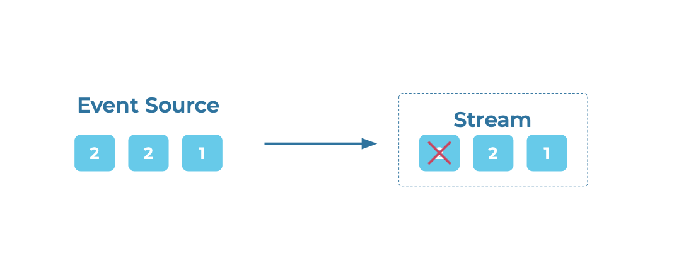

---
seo:
  title: Idempotent Writer
  description: An idempotent writer can produce the same event to an event streaming platform exactly once
---

# Idempotent Writer
A writer produces [Events](../event/event.md) that get written into an [Event Stream](../event-stream/event-stream.md), and under stable conditions, each event gets recorded once.
However, in the case of an operational failure or a brief network outage, an [Event Source](../event-source/event-source.md) could write the same event twice. This type of duplicate is one of the perils of distributed systems.

## Problem
How can an [Event Streaming Platform](../event-stream/event-streaming-platform.md) ensure that an Event Source does not write the same event twice?

## Solution


Generally speaking, this can be addressed by native support for idempotent clients.
This means that a writer may try to produce an event more than once, but the Event Streaming Platform tracks and detects duplicate attempts for the same event, and prevents the duplicate event from being written again, which ensures that computed results are always accurate. 

## Implementation
To make an Apache Kafka® producer idempotent, configure your producer with

```
enable.idempotence=true
```

What this does is, each batch of messages sent to the Kafka cluster contains a sequence number that the broker uses to dedupe any duplicate send. This sequence number is persisted to the replicated log, so even if the leader broker fails, any broker that takes over will also know if a resend is a duplicate.

## Considerations
A solution that necessitates strong EOS guarantees should enable EOS at all stages of the pipeline, not just on the writer.
An Idempotent Writer is therefore typically combined with an [Idempotent Reader](../event-processing/idempotent-reader.md) and transactional processing.

## References
* Blog on [Exactly-once semantics in Apache Kafka](https://www.confluent.io/blog/simplified-robust-exactly-one-semantics-in-kafka-2-5/)
* [Idempotent Producer Kafka Tutorial](https://kafka-tutorials.confluent.io/message-ordering/kafka.html)
