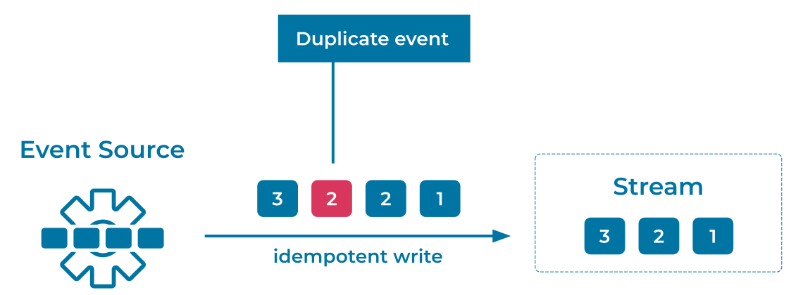

---
seo:
  title: Idempotent Writer
  description: An Idempotent Writer produces an Event to an Event Streaming Platform exactly once.
---

# Idempotent Writer
A writer produces [Events](../event/event.md) that are written into an [Event Stream](../event-stream/event-stream.md), and under stable conditions, each Event is recorded only once.
However, in the case of an operational failure or a brief network outage, an [Event Source](../event-source/event-source.md) may need to retry writes. This may result in multiple copies of the same Event ending up in the Event Stream, as the first write may have actually succeeded and the client simply did not receive the response. This type of duplication is one of the perils of distributed systems.

## Problem
How can an [Event Streaming Platform](../event-stream/event-streaming-platform.md) ensure that an Event Source does not write the same Event more than once?

## Solution


Generally speaking, this can be addressed by native support for idempotent clients.
This means that a writer may try to produce an Event more than once, but the Event Streaming Platform detects and discards duplicate write attempts for the same Event. The resulting Events in the Event Stream are unique, ensuring that a consumer's computed results remain accurate.

## Implementation
To make an Apache Kafka® producer idempotent, configure your producer with the following setting:

```
enable.idempotence=true
```

The Kafka producer tags each batch of Events that it sends to the Kafka cluster with a sequence number. The broker uses this sequence number to enforce deduplication of Events sent from this specific producer. Each batch's sequence number is persisted to the replicated log, so that even if the leader broker fails, any new leader will also know if a given batch is a duplicate.

## Considerations
Enabling idempotency for a Kafka producer not only ensures that duplicate Events are fenced out from the log, it also ensures that they are written in order. This is because the brokers accept a batch of Events only if its sequence number is exactly one greater than that of the last committed batch; otherwise, it results in an out-of-sequence error.

Exactly-once semantics (EOS) allows [Event Streaming Applications](../event-processing/event-processing-application.md) to process data without loss or duplication, ensuring that computed results are always accurate. Any solution that requires strong EOS guarantees should also enable EOS at all stages of the pipeline, not just on the writer. An Idempotent Writer is therefore typically combined with an [Idempotent Reader](../event-processing/idempotent-reader.md) and transactional processing.

## References
* Blog post about [exactly-once semantics in Apache Kafka](https://www.confluent.io/blog/simplified-robust-exactly-one-semantics-in-kafka-2-5/)
* Tutorial on [How to maintain message ordering and no message duplication](https://kafka-tutorials.confluent.io/message-ordering/kafka.html)
