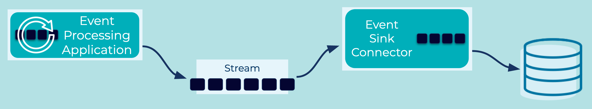

# Event Sink Connector

## Problem
How can I connect an application or system like a DB to an event streaming platform so that it can receive events?

## Solution Pattern
When connecting a system like a relational database to Kafka, the most common option is to use Kafka connectors. The connector reads events from the event streaming platform, performs any necessary transformations, and writes the events to the specified sink.


## Example Implementation
```
CREATE SINK CONNECTOR JDBC_SINK_POSTGRES_01 WITH (
    'connector.class'     = 'io.confluent.connect.jdbc.JdbcSinkConnector',
    'connection.url'      = 'jdbc:postgresql://postgres:5432/',
    'connection.user'     = 'postgres',
    'connection.password' = 'postgres',
    'topics'              = 'TEMPERATURE_READINGS_TIMESTAMP_MT',
    'auto.create'         = 'true',
    'auto.evolve'         = 'true'
);
```

## Considerations
* Existing Kafka connectors: there are many such event sink connectors readily available for Apache Kafka, e.g. connectors for relational databases or object storage systems like AWS S3.  See Confluent Hub for available connectors.
* Security policies as well as regulatory compliance may require appropriate settings for encrypted communication, authentication and authorization, etc. between event sink, event sink connector, and the event streaming platform.

## References
* [Confluent Connector Hub](https://www.confluent.io/hub/) 

