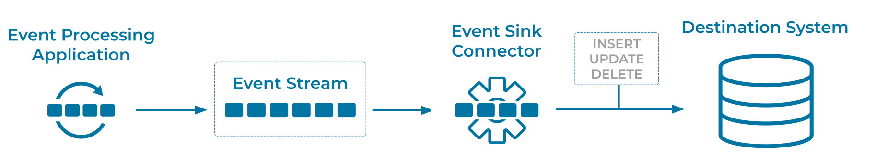

---
seo:
  title: Event Sink Connector
  description: Event Sink Connectors transfer events from an event stream into a specific external system
---

# Event Sink Connector
Connecting external systems to the [Event Streaming Platform](../event-stream/event-streaming-platform.md) allows for advanced and specialized integrations. 

## Problem
How can we connect applications or external systems, like databases, to an [Event Streaming Platform](../event-stream/event-streaming-platform.md) so that it can receive [Events](../event/event.md)?

## Solution


Event Sink Connector is a specific implementation of an [Event Sink](event-sink.md). Use an Event Sink Connector to transfer [Events](../event/event.md) from the [Event Stream](../event-stream/event-stream.md) into the specific external system. 

## Implementation
```
CREATE SINK CONNECTOR JDBC_SINK_POSTGRES_01 WITH (
    'connector.class'     = 'io.confluent.connect.jdbc.JdbcSinkConnector',
    'connection.url'      = 'jdbc:postgresql://postgres:5432/',
    'connection.user'     = 'postgres',
    'connection.password' = 'postgres',
    'topics'              = 'TEMPERATURE_READINGS_TIMESTAMP_MT',
    'auto.create'         = 'true',
    'auto.evolve'         = 'true'
);
```

When connecting a system like a relational database to Apache Kafka®, the most common option is to use [Kafka Connect](https://docs.confluent.io/platform/current/connect/index.html). The connector reads events from the [Event Streaming Platform](../event-stream/event-streaming-platform.md), performs any necessary transformations, and writes the [Events](../event/event.md) to the specified [Event Sink](../event-sink/event-sink.md).

## Considerations
* There are many Event Sink Connectors readily available for Apache Kafka, e.g. connectors for relational databases or object storage systems like AWS S3.  See [Confluent Hub](https://www.confluent.io/hub/) for available connectors.
* Security policies as well as regulatory compliance may require appropriate settings for encrypted communication, authentication and authorization, etc. between event sink, event sink connector, and the event streaming platform.

## References
* This pattern is derived from [Channel Adapter](https://www.enterpriseintegrationpatterns.com/patterns/messaging/ChannelAdapter.html) in Enterprise Integration Patterns by Gregor Hohpe and Bobby Woolf
