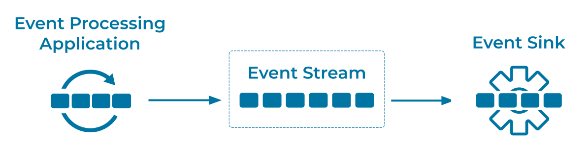

---
seo:
  title: Event Sink
  description: Event Sinks read events from an event streaming platform and are conceptually opposite of an event source
---

# Event Sink
Various components in an [Event Streaming Platform](../event-stream/event-streaming-platform.md) will read or receive [Events](../event/event.md). An Event Sink is the generalization of these components, which can include [Event Processing Applications](../event-processing/event-processing-application.md), cloud services, databases, IoT sensors, mainframes, and more.

Conceptually, an Event Sink is the opposite of an [Event Source](../event-source/event-source.md). In practice, however, components such as an [Event Processing Application](../event-processing/event-processing-application.md) can act as both an [Event Source](../event-source/event-source.md) and an Event Sink.

## Problem
How can we read (or consume / subscribe to) [Events](../event/event.md) in an [Event Streaming Platform](../event-stream/event-streaming-platform.md)?

## Solution



Use an Event Sink, which typically acts as a client in an [Event Streaming Platform](../event-stream/event-streaming-platform.md). Examples are an [Event Sink Connector](event-sink-connector.md) (which continuously exports [Event Streams](../event-stream/event-stream.md) from the [Event Streaming Platform](../event-stream/event-streaming-platform.md) into an external system such as a cloud service or a relational database) or an [Event Processing Application](../event-processing/event-processing-application.md) such as a [Kafka Streams](https://docs.confluent.io/platform/current/streams/index.html) application or [Apache Flink®](https://nightlies.apache.org/flink/flink-docs-stable/).

## Implementation

Flink SQL example: Reading events from an existing Apache Kafka® topic as a Flink table for further processing.

```
CREATE TABLE orders (
    order_id INT,
    item_id INT,
    quantity INT,
    unit_price DOUBLE,
    ts TIMESTAMP(3),
    WATERMARK FOR ts AS ts
);
```

Generic Kafka Consumer application: See [Getting Started with Apache Kafka and Java](/get-started/java) for a full example: 

```
consumer.subscribe(Collections.singletonList("stream"));
      while (keepConsuming) { 
        final ConsumerRecords<String, EventRecord> consumerRecords = consumer.poll(Duration.ofSeconds(1));  
        recordsHandler.process(consumerRecords); 
      }
```

## References
* The Kafka Streams library of Apache Kafka is another popular choice of developers to implement elastic applications and microservices that read, process, and write events. See [Filter a stream of events](https://developer.confluent.io/confluent-tutorials/filtering/flinksql/) for a first example.
