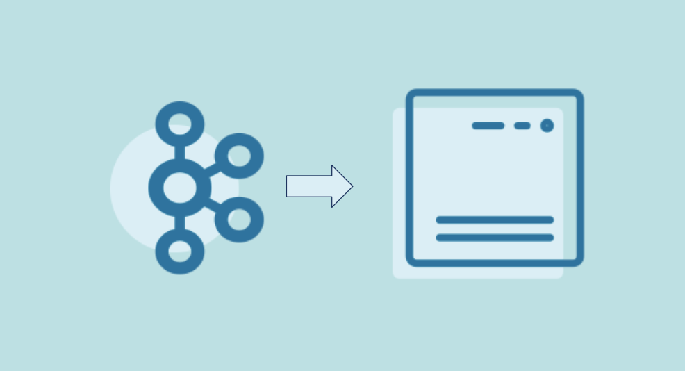

# Event Sink

## Problem
How can a stream of events be written into a sink, any destination that wants to receive those events?
This can be a generic consumer application that reads a stream of events (or for a more specific example, see `Event Sink Connector`).

## Solution Pattern



An application can read a stream of events from an event streaming platform.

## Example Implementation

```
consumer.subscribe(Collections.singletonList("stream"));
      while (keepConsuming) { 
        final ConsumerRecords<String, EventRecord> consumerRecords = consumer.poll(Duration.ofSeconds(1));  
        recordsHandler.process(consumerRecords); 
      }
```

## References
* [Kafka Tutorial](https://kafka-tutorials.confluent.io/creating-first-apache-kafka-consumer-application/kafka.html): Kafka consumer application
