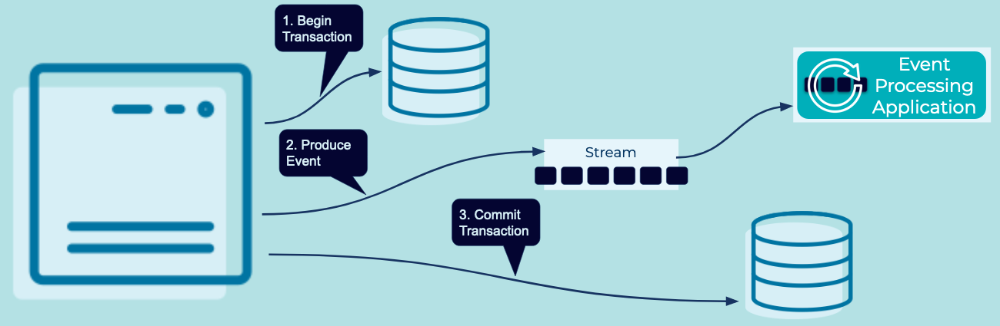

---
seo:
  title: Database Write Aside
  description: Simultaneously update a value in a database and create an associated event in an event streaming platform.
---

# Database Write Aside
Applications which write directly to a database may want to produce an associated [Event](../event/event.md) to the [Event Streaming Platform](../event-stream/event-streaming-platform.md) for each write operation allowing downstream [Event Processing Applications](../event-processing/event-processing-application.md) to be notified and consume the [Event](../event/event.md).

## Problem

How do I update a value in a database and create an associated event with the least amount of effort?


## Solution



Write to a database, then write to Kafka. Perform the write to Kafka as the last step in a database transaction to ensure an atomic dual commit (aborting the transaction if the write to Kafka fails). 


## Implementation
```
//Enable transactions
db.setAutoCommit(false);

try{
   //insert into the DB
   sql = db.prepareStatement("insert into mydb.events values (?)");
   sql.setString(event.toString());
   sql.executeUpdate();

   //insert into Kafka
   producer.send(event.key(), event.value());

   //commit to the DB
   db.commit();
} catch (SQLException e ) {
   db.rollback();
}
```


## Considerations
In its default form, this pattern guarantees dual-write for most use cases. However, should the database transaction fail at commit time (say, because the database server has crashed) the write to Kafka cannot be rolled back unless transactions have been enabled. For many use cases, this eventuality will be tolerable as the dual-write can be retried once the failure is fixed, and most event consumers will implement idempotence anyway. However, application programmers need to be aware that there is no firm guarantee. 

Transactional messaging systems like Kafka can be used to provide stronger guarantees so long as all event consumers have the transactions feature enabled. 


## References
* See [Database Write Through](database-write-through.md) for an alternative example of writing database changes to an Event Stream
