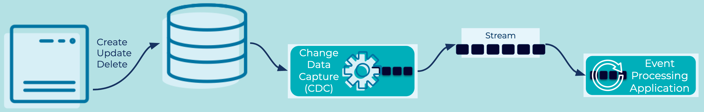

---
seo:
  title: Database Write Through
  description: Update a value in a database and create an associated event with at-least-once guarantees.
---

# Database Write Through
For architectural or legacy purposes, data-centric applications may write directly to a database. [Event Processing Applications](../event-processing/event-processing-application.md) will need to reliably consume data from these systems using [Events](../event/event.md) on [Event Streams](../event-stream/event-stream.md).

## Problem
How do we update a value in a database and create an associated [Event](../event/event.md) with at-least-once guarantees?

## Solution


Some applications write directly to a database table, therefore the database table is the [Event Source](event-source.md). We can deploy a Change Data Capture (CDC) solution to continuously capture writes (inserts, updates, deletes) to that database table and produce them as [Events](../event/event.md) onto an [Event Stream](../event-stream/event-stream.md).  The events in stream can then be consumed by [Event Processing Applications](../event-processing/event-processing-application.md). Additionally, the [Event Stream](../event-stream/event-stream.md) can be read into a Projection Table, for example with [ksqlDB](https://ksqldb.io/), so that it can be queried by other applications.

## Implementation
[Kafka connectors](https://docs.confluent.io/platform/current/connect/index.html) provide the ability to scalably and reliably move data between Apache Kafka® and other data systems. There are many types of connectors that can connect to many types of databases.  For example, using the [JDBC Source connector](https://docs.confluent.io/kafka-connect-jdbc/current/source-connector/index.html) for Kafka Connect allows for streaming of changes from a source database to Kafka topics.

```bash
  {
    "connector.class": "MySqlCdcSource",
    "name": "MySqlCdcSourceConnector_0",
    "kafka.api.key": "****************",
    "kafka.api.secret": "******************************",
    "database.hostname": "database-2.<host-ID>.us-west-2.rds.amazonaws.com",
    "database.port": "3306",
    "database.user": "admin",
    "database.password": "**********",
    "database.server.name": "mysql",
    "database.whitelist": "employee",
    "table.includelist":"employees.departments",
    "snapshot.mode": "initial",
    "output.data.format": "AVRO",
    "tasks.max": "1"
  }
```

The above shows an example configuration to deploy a MySQL Source CDC Connector (Debezium) streaming data from a MySQL database to Kafka topics.

Confluent Cloud CLI can deploy a connector on the command line from a configuration, for example:
```bash
ccloud connector create --config <connector-config-file.json>
```

## Considerations
- This pattern is a specialization of the [Event Source Connector](event-source-connector.md) that guarantees that all state changes represented in an [Event Source](../event-source/event-source.md) are captured in an [Event Streaming Platform](../event-stream/event-streaming-platform.md).
- The processing guarantees (cf. "Guaranteed Delivery") to choose from — e.g., at-least-once, exactly-once — for the CDC data flow depend on the CDC and Database technology utilized.
- There is a certain delay until changes in the source database table are available in the CDC-ingested event stream. The amount of the delay depends on a variety of factors, including the features and configuration of the Event Source Connector. In many typical scenarios the delay is less than a few seconds.
- [Events](../event/event.md) typically require the row key to be used as the Kafka event key (aka record/message key), which is the only way to ensure all [Events](../event/event.md) for the same DB table row go to the same Kafka topic-partition and are thus totally ordered. They also typically model deletes as tombstone events, i.e. an event with a non-null key and a null value. By ensuring totally ordered events for each row, consumers see an eventually-consistent representation of these events for each row.

## References
* See [Oracle CDC Source Connector](https://www.confluent.io/blog/introducing-confluent-oracle-cdc-connector/) for details of a premium CDC connector for Oracle DB.
* See [Integrate External Systems to Kafka](https://docs.confluent.io/cloud/current/connectors/index.html) on Confluent documentation for information on source connectors.
* [Kafka Connect Deep Dive - JDBC Source Connector](https://www.confluent.io/blog/kafka-connect-deep-dive-jdbc-source-connector/) blog post
* See [Database Write Aside](database-write-aside.md) for an alternative example of writing database changes to an Event Stream
