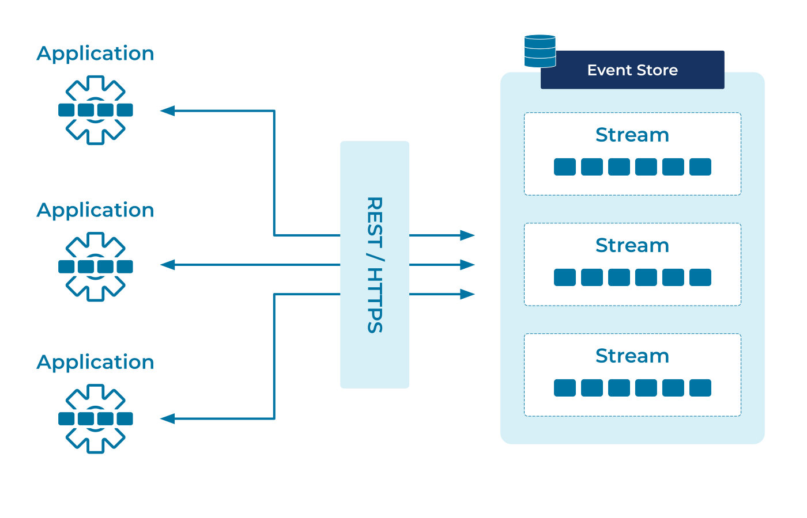

---
seo:
  title: Event Gateway
  description: A good Event Gateway provides the broadest possible access to different users of the Event Store.
---

# Event Gateway

One of the key benefits of adopting an
[Event](../event/event.md)-first architecture is to foster
collaboration. Our aim is to ensure that Team A can produce data, Team
B can process it and Team C can report on it, with only one thing
coupling the teams together - the data itself.  Teams shouldn't have
to agree on shared libraries, synchronized release schedules, or
common tooling. Data becomes the one true interface.

In reality though, each team will still have to communicate with the
[Event Store][event_store] itself. How do we maximize access? How do
we ensure that every team can use the event store, without insisting
they choose from a short-list of approved languages?  How do we
accommodate the team that insists on using Idris<sup>+</sup>?

<i><sup>+</sup>Or Haskell, or Rust, or Erlang, or whatever other
language we didn't plan for...</i>

## Problem

How does an an [Event Streaming
Platform](../event-stream/event-streaming-platform.md) provide access
to the widest-possible range of users?

## Solution



Provide clients for the languages you can support directly, and then
provide a universal client that _every_ language can access.

## Implementation

Confluent Cloud provides [client libraries][client_libraries] for 5
popular languages, with community support for a further 12 (and
counting). On top of that, universal access is provided by the one
protocol that [every language][fortran_http] can access: HTTP.

The [Confluent REST APIs][rest_apis] provide the broadest-possible
support for clients to produce and consume data, formatted as JSON,
Protobuf, Avro or even raw base64-encoded bytes.

As a simple example, we can post JSON-encoded events to a topic called `sales` with:

```sh
curl -X POST \
  -H "Content-Type: application/vnd.kafka.json.v2+json" \
  --data '{"records":[{"key":"alice","value":{"tickets":5}},{"key":"bob","value":{"tickets":10}}]}' \
  http://localhost:8082/topics/sales
```

```json
{
  "offsets": [
    {
      "partition": 0,
      "offset": 0,
      "error_code": null,
      "error": null
    },
    {
      "partition": 0,
      "offset": 1,
      "error_code": null,
      "error": null
    }
  ],
  "key_schema_id": null,
  "value_schema_id": null
}
```

## Considerations

In a perfect world, every database would have first-class support for
every language. Realistically some languages will be better
accommodated than others, but we can still ensure every language has
access to every important feature.

In practice, this fits well with programmer expectations. Users of
mainstream languages expect to be well accommodated. But equally,
users of more niche languages expect to do a little more work to get
started. As long as the access is possible, logical, and reliable, a
little extra integration work presents little obstacle to adoption.

## References

* The [Confluent REST APIs][rest_apis] documentation.

[event_store]: ../event-storage/event-store.md
[rest_apis]: https://docs.confluent.io/platform/current/kafka-rest/index.html
[client_libraries]: https://docs.confluent.io/platform/current/clients/index.html
[fortran_http]: https://github.com/interkosmos/fortran-curl/blob/master/examples/http/http.f90
[curl]: https://curl.se/

