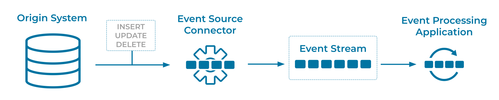

---
seo:
  title: Event Source Connector
  description: An event source connector is used to integrate data from existing data systems into an Event Streaming Platform. 
---
# Event Source Connector
An [Event Processing Application](../event-processing/event-processing-application.md) may want to consume data from existing data systems, which are not themselves [Event Sources](event-source.md).

## Problem
How can we connect cloud services and traditional systems, such as relational databases, to an [Event Streaming Platform](../event-stream/event-streaming-platform.md), converting these systems' data at rest to data in motion with [Events](../event/event.md)?

## Solution


Generally speaking, we need to find a way to extract data as [Events](../event/event.md) from the origin system. With relational databases, for example, a common technique is to use [Change Data Capture](https://en.wikipedia.org/wiki/Change_data_capture), where changes to database tables—such as inserts, updates, and deletes—are captured as [Events](../event/event.md), which can then be ingested into another system. The components that perform this extraction and ingestion of [Events](../event/event.md) are typically called "connectors". The connectors turn the origin system into an [Event Source](../event-source/event-source.md), generate [Events](../event/event.md) from the data, and then send these [Events](../event/event.md) to the [Event Streaming Platform](../event-stream/event-streaming-platform.md).

## Implementation
When connecting cloud services and traditional systems to [Apache Kafka®](https://kafka.apache.org/), the most common solution is to use [Kafka Connect](https://docs.confluent.io/platform/current/connect/index.html). There are hundreds of ready-to-use connectors available on [Confluent Hub](https://www.confluent.io/hub/), including blob stores such as AWS S3, cloud services such as Salesforce and Snowflake, relational databases, data warehouses, traditional message queues, flat files, and more. Confluent also provides many [fully-managed Kafka connectors](https://docs.confluent.io/cloud/current/connectors/index.html) in the cloud.

There are several options for deploying such connectors. For example, the streaming database [ksqlDB](https://ksqldb.io/) provides the ability to manage Kafka connectors using SQL statements.
```
CREATE SOURCE CONNECTOR `jdbc-connector` WITH(
    "connector.class"='io.confluent.connect.jdbc.JdbcSourceConnector',
    "connection.url"='jdbc:postgresql://localhost:5432/my.db',
    "mode"='bulk',
    "topic.prefix"='jdbc-',
    "table.whitelist"='users',
    "key"='username');
```

## Considerations
* End-to-end data delivery guarantees (such as exactly-once delivery or at-least-once delivery) depend primarily on three factors: (1) the capabilities of the origin event source, such as a cloud service or relational database; (2) the capabilities of the event source connector, and (3) the capabilities of the destination event streaming platform, such as Apache Kafka or Confluent.
* Security policies, as well as regulatory compliance, may require appropriate settings for encrypted communication, authentication, authorization, etc. between the event source, the event source connector, and the destination event streaming platform.

## References
* This pattern is derived from the [Channel Adapter](https://www.enterpriseintegrationpatterns.com/patterns/messaging/ChannelAdapter.html) pattern in _Enterprise Integration Patterns_, by Gregor Hohpe and Bobby Woolf
* See the [Add key to data ingested through Kafka Connect](https://kafka-tutorials.confluent.io/connect-add-key-to-source/ksql.html) tutorial for a full Kafka Connect example
