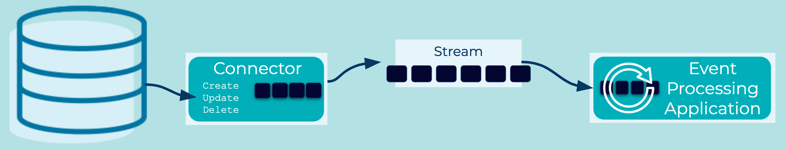

# Event Source Connector
[Event Processing Applications](../event-processing/event-processing-application.md) may want to consume data from existing data systems, which are not themselves [Event Sources](event-source.md).

## Problem
How can we connect cloud services and traditional systems, like relational databases, to an [Event Streaming Platform](../event-stream/event-streaming-platform.md), converting their data at rest to data in motion with [Events](../event/event.md).

## Solution


Generally speaking, we need to find a way to extract data as events from the origin system. For relational databases, for example, a common technique is to use [Change Data Capture[(https://en.wikipedia.org/wiki/Change_data_capture), where changes to database tables—such as INSERTs, UPDATES, DELETEs—are captured as events, which can then be ingested into another system. The components that perform this extraction and ingestion of events are typically called "connectors". The connectors turn the origin system into an [Event Source](../event-source/event-source.md), then generate [Events](../event/event.md) from that data, and finally sends these [Events](../event/event.md) to the [Event Streaming Platform](../event-stream/event-streaming-platform.md).

## Implementation
[ksqlDB](https://ksqldb.io/) provides an ability to manage [Kafka Connect](https://docs.confluent.io/platform/current/connect/index.html) with a SQL like syntax.
```
CREATE SOURCE CONNECTOR JDBC_SOURCE_POSTGRES_01 WITH (
    'connector.class'= 'io.confluent.connect.jdbc.JdbcSourceConnector',
    'connection.url'= 'jdbc:postgresql://postgres:5432/postgres',
    'connection.user'= 'postgres',
    'connection.password'= 'postgres',
    'mode'= 'incrementing',
    'incrementing.column.name'= 'city_id',
    'topic.prefix'= 'postgres_'
);
```

## Considerations
* End-to-end data delivery guarantees (e.g., at-least-once or exactly-once delivery; cf. "Guaranteed Delivery") depend primarily on three factors: (1) the capabilities of the event source, such as a relational or NoSQL database; (2) the capabilities of the destination event streaming platform, such as Apache Kafka; and (3) the capabilities of the event source connector.
* Existing Kafka Connectors: there are many such event source connectors readily available for Apache Kafka, e.g. connectors for relational databases or object storage systems like AWS S3.  See the [Confluent Hub](https://www.confluent.io/hub/) for available connectors.
* Security policies as well as regulatory compliance may require appropriate settings for encrypted communication, authentication and authorization, etc. between event source, event source connector, and the destination event streaming platform.

## References
* This pattern is derived from [Channel Adapter](https://www.enterpriseintegrationpatterns.com/patterns/messaging/ChannelAdapter.html) in Enterprise Integration Patterns by Gregor Hohpe and Bobby Woolf
* See this [Kafka Tutorial](https://kafka-tutorials.confluent.io/connect-add-key-to-source/ksql.html) for a full Kafka Connect example
