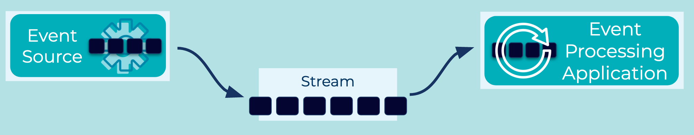

# Event Source 
Various components in an [Event Streaming Platform](../event-stream/event-streaming-platform.md) will generate [Events](../event/event.md). An Event Source is the generalization of these components, which can include [Event Processing Applications](../event-processing/event-processing-application.md), cloud services, databases, IoT sensors, mainframes, and more.

Conceptually, an event source is the opposite of an [Event Sink](../event-sink/event-sink.md). In practice, however, components such as an event processing application can act as both an event source and an event sink.

## Problem
How can I create Events in an Event Streaming Platform?

## Solution


Use an Event Source, which typically acts as a client in an Event Streaming Platform. Examples are an [Event Source Connector](../event-source/event-source-connector.md) (which continuously imports data as event streams into the event streaming platform from an external system such as a cloud services or a relational database) or an [Event Processing Application](../event-processing/event-processing-application.md) such as a [Kafka Streams](https://docs.confluent.io/platform/current/streams/index.html) application and the streaming database [ksqlDB](https://ksqldb.io/).

## Implementation
For instance, the streaming database [ksqlDB](https://ksqldb.io/), provides an `INSERT` statement to directly write new Events directly to the [Event Stream](../event-stream/event-stream.md).
```
CREATE STREAM users (username VARCHAR, name VARCHAR, phone VARCHAR)
	with (kafka_topic='users-topic', value_format='json');
INSERT INTO users (username, name, phone)
  VALUES ('awalther', 'Allison', '+1 555-555-1234');
```

## References
* [ksqlDB](https://ksqldb.io/) The event streaming database purpose-built for stream processing applications.
