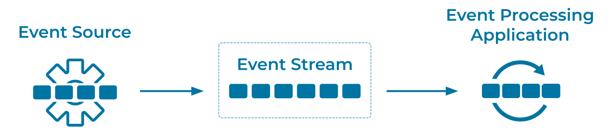

---
seo:
  title: Event Source
  description: An event source writes events into an event streaming platform.
---

# Event Source 
Various components in an [Event Streaming Platform](../event-stream/event-streaming-platform.md) will generate [Events](../event/event.md). An Event Source is the generalization of these components, which can include [Event Processing Applications](../event-processing/event-processing-application.md), cloud services, databases, IoT sensors, mainframes, and more.

Conceptually, an event source is the opposite of an [Event Sink](../event-sink/event-sink.md). In practice, however, components such as an event processing application can act as both an event source and an event sink.

## Problem
How can we create [Events](../event/event.md) in an [Event Streaming Platform](../event-stream/event-streaming-platform.md)?

## Solution


Use an Event Source, which typically acts as a client in an [Event Streaming Platform](../event-stream/event-streaming-platform.md). Examples are an [Event Source Connector](../event-source/event-source-connector.md) (which continuously imports data as [Event Streams](../event-stream/event-stream.md) into the [Event Streaming Platform](../event-stream/event-streaming-platform.md) from an external system such as a cloud service or a relational database), or an [Event Processing Application](../event-processing/event-processing-application.md), such as a [Kafka Streams](https://docs.confluent.io/platform/current/streams/index.html) or [Apache Flink®](https://nightlies.apache.org/flink/flink-docs-stable/) application.

## Implementation
Normally, an actual component such as an application for Apache Kafka® would be writing [Events](../event/event.md) into an [Event Stream](../event-stream/event-stream.md) via a client library, API, gateway, etc. We can also write events directly using SQL syntax; [Flink SQL](https://nightlies.apache.org/flink/flink-docs-stable/docs/dev/table/sql/gettingstarted/), for example, provides an `INSERT` statement.
```
CREATE TABLE temperature_readings (
    sensor_id INT,
    temperature DOUBLE,
    ts TIMESTAMP(3),
    WATERMARK FOR ts AS ts
);
INSERT INTO temperature_readings VALUES
    (0, 55, TO_TIMESTAMP('2024-11-15 02:15:30')),
    (0, 50, TO_TIMESTAMP('2024-11-15 02:20:30')),
    (0, 45, TO_TIMESTAMP('2024-11-15 02:25:30'));
```

## References
* [How to build client applications](https://docs.confluent.io/cloud/current/client-apps/index.html) for writing events into an [Event Stream](../event-stream/event-stream.md).
