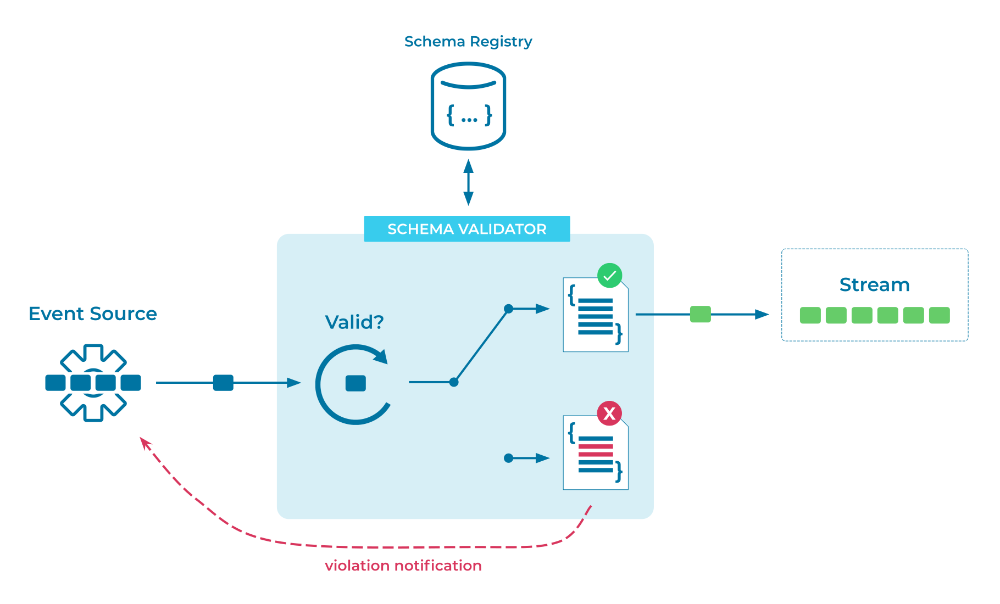

---
seo:
  title: Schema Validator
  description: Schema Validators enforce defined schemas for all events sent to an event stream
---

# Schema Validator
In an [Event Streaming Platform](../event-stream/event-streaming-platform.md), [Event Sources](../event-source/event-source.md), which create and write [Events](../event/event.md), are decoupled from [Event Sinks](../event-sink/event-sink.md) and [Event Processing Applications](../event-processing/event-processing-application.md), which read and process the events. Ensuring interoperability between the producers and the consumers of events requires that they agree on the data schemas for the events. This is an important aspect of putting [Data Contracts](../event/data-contract.md) in place for data governance.

## Problem
How can I enforce a defined schema for all [Events](../event/event.md) sent to an [Event Stream](../event-stream/event-stream.md)?

## Solution

Validate that an [Event](../event/event.md) conforms to the defined schema(s) of an [Event Stream](../event-stream/event-stream.md) prior to writing the event to the stream. You can perform this schema validation in two ways:

1. On the server side, the [Event Streaming Platform](../event-stream/event-streaming-platform.md) that receives the [Event](../event/event.md) can validate the event. The Event Streaming Platform can reject the event if it fails schema validation and thus violates the [Data Contract](../event/data-contract.md).
2. On the client side, the [Event Source](../event-source/event-source.md) that creates the [Event](../event/event.md) can validate the event. For example, an [Event Source Connector](../event-source/event-source-connector.md) can validate events prior to ingesting them into the [Event Streaming Platform](../event-stream/event-streaming-platform.md), or an [Event Processing Application](../event-processing/event-processing-application.md) can use the schema validation functionality provided by a serialization library that supports schemas (such as the Confluent serializers and deserializers for Kafka).

## Implementation

With Confluent, schema validation is fully supported with a per-environment managed [Schema Registry](https://docs.confluent.io/platform/current/schema-registry/index.html). Use the Confluent Cloud Console to enable Schema Registry in your cloud provider of choice. Schemas can be managed per topic using either the Confluent Cloud Console or the [Confluent CLI](https://docs.confluent.io/confluent-cli/current/overview.html). The following command creates a schema using the CLI:

```
confluent schema-registry schema create --subject employees-value --schema employees.avsc --type AVRO
```

## Considerations
* Schema Validator is a data governance implementation of "Schema on Write", which enforces data conformance prior to event publication. An alternative strategy is [Schema On Read](../event/schema-on-read.md), where data formats are not enforced on write, but consuming Event Processing Applications are required to validate data formats as they read each event. 
* Server-side schema validation is preferable when you want to enforce this pattern centrally inside an organization. In contrast, client-side validation assumes the cooperation of client applications and their developers, which may or may not be acceptable (for example, in regulated industries).
* Schema validation results in a load increase, because it impacts the write path of every event. Client-side validation primarily impacts the load of client applications. Server-side schema validation increases the load on the event streaming platform, whereas client applications are less affected (here, the main impact is dealing with rejected events; see [Dead Letter Stream](../event-processing/dead-letter-stream.md)).

## References
* See the [Schema Compatibility](../event-stream/schema-compatibility.md) pattern for information on how schemas can evolve over time while continuing to be verified.
* Learn more about how to [Manage and Validate Schemas with Confluent and Kafka](https://docs.confluent.io/cloud/current/client-apps/schemas-manage.html).
