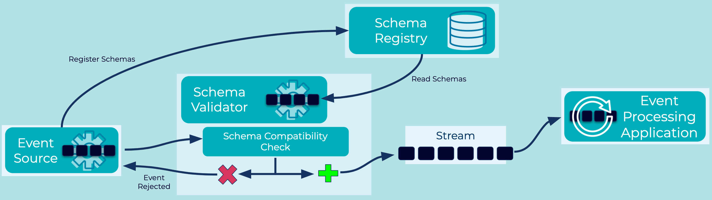

# Schema Validator
In an [Event Streaming Platform](../event-stream/event-streaming-platform.md), [Event Sources](../event-source/event-source.md), which create and write [Events](../event/event.md), are decoupled from [Event Sinks](../event-sink/event-sink.md) and [Event Processing Applications](../event-processing/event-processing-application.md), which read and process these events. Ensuring interoperability between the producers and the consumers of events requires that they agree on the data schemas for the events, which is an important aspect of putting [Data Contracts](../event/data-contract.md) in place for data governance purposes.

## Problem
How do I enforce that [Events](../event/event.md) sent to an [Event Stream](../event-stream/event-stream.md) conform to a defined schema for that stream?

## Solution

Validate whether an [Event](../event/event.md) conforms to the defined schema(s) of an [Event Stream](../event-stream/event-stream.md) prior to writing the event to the stream. Such schema validation can be done:

1. On the server side by the [Event Streaming Platform](../event-stream/event-streaming-platform.md) that receives the [Event](../event/event.md). [Events](../event/event.md) that fail schema validation and thus violate the [Data Contract](../event/data-contract.md) are rejected.
2. On the client side by the [Event Source](../event-source/event-source.md) that creates the [Event](../event/event.md). For example, an [Event Source Connector](../event-source/event-source-connector.md) can validate [Events](../event/event.md) prior to ingestion into the [Event Streaming Platform](../event-stream/event-streaming-platform.md). Or, an [Event Processing Application](../event-processing/event-processing-application.md) can use the schema validation functionality provided by a serialization library that supports schemas (e.g., Confluent's serializer/deserializers for Kafka).

## Implementation
With Confluent, schema validation is fully supported with a per-environment managed [Schema Registry](https://docs.confluent.io/platform/current/schema-registry/index.html) service. Use the Confluent UI to enable schema registry in your cloud provider of choice. Schemas can be managed per topic using the Confluent UI or the [Confluent Cloud CLI](https://docs.confluent.io/ccloud-cli/current/index.html). An example command to create a schema using the CLI:

```
ccloud schema-registry schema create --subject employees-value --schema employees.json --type AVRO
```

## Considerations
* Schema Validator is a data governance implementation of "Schema on Write", which enforces data conformance prior to event publication. An alternative strategy is [Schema On Read](../event/schema-on-read.md), where data formats are not enforced on write. Instead, consuming Event Processing Applications are required to validate data formats as they read each event. 
* Server-side schema validation is preferable when you want to enforce this pattern centrally inside an organization.  In contrast, client-side validation assumes the cooperation of client applications and their developers, which may or may not be acceptable (e.g., in regulated industries).
* Schema validation results in a load increase because it impacts the write path of every event.  Client-side validation impacts primarily the load of the client applications.  Server-side schema validation increases the load on the event streaming platform, whereas client applications are less affected (here, the main impact is dealing with rejected events; see [Dead Letter Stream](../event-processing/dead-letter-stream.md)).

## References
* See the [Schema Compatibility](../event-stream/schema-compatibility.md) pattern for information on how schemas can evolve over time and be verified.
* Learn more how to [Manage and Validate Schemas with Confluent and Kafka](https://docs.confluent.io/cloud/current/client-apps/schemas-manage.html).
