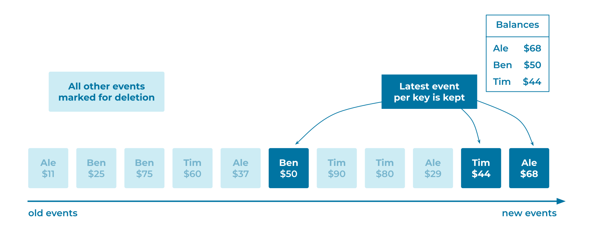

# Compacted Event Stream
[Event Streams](../event-stream/event-stream.md) often represent keyed snapshots of state, similar to a [Table](../table/state-table.md) in a relational database. That is, the [Events](../event/event.md) contain a primary key (identifier) and data that represents the latest information of the business entity related to the Event, such as the latest balance per customer account. [Event Processing Applications](../event-processing/event-processing-application.md) will need to process these Events to determine the current state of the business entity. However, processing the entire Event Stream history is often not practical.

## Problem
How can a (keyed) [Table](../table/state-table.md) be stored in an [Event Stream](../event-stream/event-stream.md) forever, using the minimum amount of space?

## Solution


Remove events from the [Event Stream](../event-stream/event-stream.md) that represent outdated information and have been superseded by new [Events](../event/event.md). The table's current data (i.e., its latest state) is represented by the remaining [Events](../event/event.md) in the stream.

This approach bounds the storage space of the table's [Event Stream](../event-stream/event-stream.md) to Θ(number of unique keys currently in table), rather than Θ(total number of change events for table). In practice, the number of unique keys (e.g., unique customer IDs) is typically much smaller than the number of table changes (e.g., total number of changes across all customer profiles). A Compacted Event Stream thus reduces the storage space significantly in most cases.

## Implementation
Apache Kafka® provides this functionality natively through its [Topic Compaction](https://kafka.apache.org/documentation/#compaction) feature. An [Event Stream](../event-stream/event-stream.md) (topic in Kafka) is scanned periodically to remove any old Events that have been superseded by newer Events that have the same key, such as as the same customer ID. Note that compaction is an asynchronous process in Kafka, so a compacted stream may contain some superseded events, which are waiting to be compacted away.

To create a compacted [Event Stream](../event-stream/event-stream.md) called `customer-profiles` with Kafka:
```bash
➜ kafka-topics --create \
    --bootstrap-server <bootstrap-url> \
    --replication-factor 3 \
    --partitions 3 \
    --topic customer-profiles \
    --config cleanup.policy=compact

Created topic customer-profiles.
```

The `kafka-topics` command can also verify the current topic's configuration:
```bash
➜ kafka-topics --bootstrap-server localhost:9092 --topic customer-profiles --describe

Topic: customer-profiles       PartitionCount: 3       ReplicationFactor: 1    Configs: cleanup.policy=compact,segment.bytes=1073741824
        Topic: customer-profiles       Partition: 0    Leader: 0       Replicas: 0     Isr: 0  Offline:
        Topic: customer-profiles       Partition: 1    Leader: 0       Replicas: 0     Isr: 0  Offline:
        Topic: customer-profiles       Partition: 2    Leader: 0       Replicas: 0     Isr: 0  Offline:
```

## Considerations
Compacted [Event Streams](../event-stream/event-stream.md) allow for some optimizations:

* First, they allow the [Event Streaming Platform](../event-stream/event-streaming-platform.md) to limit the storage growth of the [Event Stream](../event-stream/event-stream.md) in a data-specific way, rather than removing [Events](../event/event.md) universally after a pre-configured period of time.
* Second, having smaller [Event Streams](../event-stream/event-stream.md) allows for faster recovery and system migration strategies.

It is important to understand that compaction, on purpose, removes historical data from an [Event Stream](../event-stream/event-stream.md) by removing superseded Events as defined above. In many use cases, however, historical data should not be removed, such as for a stream of financial transactions, where every single transaction needs to be recorded and stored. Here, if the storage of the [Event Stream](../event-stream/event-stream.md) is the primary concern, use an [Infinite Retention Event Stream](infinite-retention-event-stream.md) instead of a compacted stream.

## References
* Compacted Event Streams are highly related to the [State Table](../table/state-table.md) pattern.
* Compacted Event Streams work a bit like simple [Log Structured Merge Trees](http://www.benstopford.com/2015/02/14/log-structured-merge-trees/).
* [Cleanup policy configuration](https://docs.confluent.io/platform/current/installation/configuration/topic-configs.html#topicconfigs_cleanup.policy) of Kafka topics.
