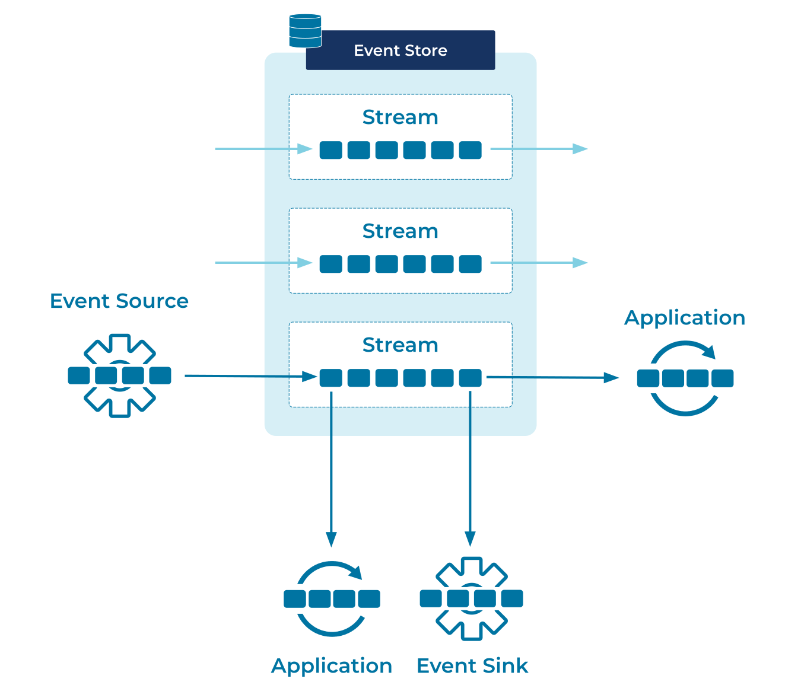

---
seo:
  title: Event Store
  description: Append-only logs are the data structure of choice for event storage and event-driven architectures.
---

# Event Store

When considering an architecture based on an [Event Streaming Platform](../event-stream/event-streaming-platform.md), the first
fundamental question is, "How do we store our events?" This isn't as
obvious as it first sounds, as we have to consider persistence, query
performance, write throughput, availability, auditing and many other
concerns. This decision will affect all the ones that follow.

## Problem

How can events be stored such that they form a reliable source of
truth for applications?

## Solution

The data structure of choice for storing incoming events is the
[Event Stream](../event-stream/event-stream.md), which is essentially an append-only log. It allows for constant-time (Θ(1)) writes, lock-free
concurrent reads, and straightforward replication across multiple
machines.

## Implementation

Apache Kafka® maintains a persistent, append-only log for each kind of
event you wish to store. Such logs are:

* Write-efficient - an append-only log is one of the fastest, cheapest
  data structures to write to.
* Read efficient - multiple readers can consume the same log without
  blocking.
* Highly-available - each event is written to multiple disks, and in
  the event of failure one of the redundant machines takes over.
* Durable - all events are written to disk, either synchronously (for
  maximum reliability) or asynchronously (for maximum
  throughput). Events can be as long-lived as needed, or stored
  forever.
* Auditable - every change is captured and persisted. Every result can
  be traced back to its source event(s).

## Considerations

It's worth briefly contrasting Apache Kafka® with message queues and
relational databases.

While queues also concern themselves with a stream of events, they
often consider events as short-lived, independent messages. A
message may only exist in memory, or it may be durable enough for data
to survive server restarts, but in general they aren't intended to
hold on to events for months or even years. Further, their querying
capabilities may be limited to simple filtering, offloading more
complex queries like joins and aggregations to the application level.

In contrast, relational databases are very good at maintaining a
persistent state of the world in perpetuity, and answering arbitrary
questions about it, but they often fall short on _auditing_ -
answering which events led up to the current state - and on
_liveness_ - what _new_ events do we need to consider.
They are predominantly designed for use cases that operate on data at rest, whereas an Event Store is designed from the ground up for data in motion and event streaming.

By beginning with a fundamental data-structure for event capture, and
building on that to provide long-term persistence and arbitrary
analysis capabilities, Apache Kafka® provides an ideal choice of event
store for modern, data-driven architectures.

## References

* See also: [Geo Replication](../compositional-patterns/geo-replication.md).
* [Using logs to build a solid data infrastructure](https://www.confluent.io/blog/using-logs-to-build-a-solid-data-infrastructure-or-why-dual-writes-are-a-bad-idea/)
* [What Is Apache Kafka?](https://www.confluent.io/what-is-apache-kafka/)
* [Kafka: The Definitive Guide](https://www.confluent.io/resources/kafka-the-definitive-guide/) free Ebook.
