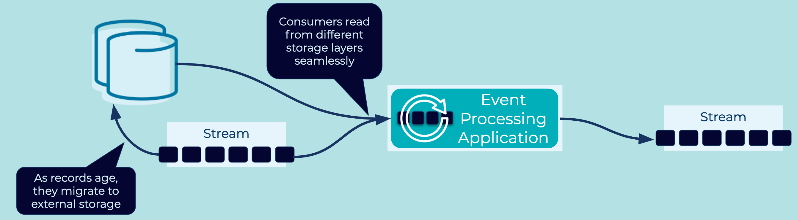

---
seo:
  title: Infinite Retention Event Stream
  description: Infinite Retention Event Stream describes retaining events indefinitely making the Event Streaming Platform the system of record. 
---

# Infinite Retention Event Stream
Many use cases demand that [Events](../event/event.md) in an [Event Stream](../event-stream/event-stream.md) will be stored for forever so that the dataset is available in its entirity.

## Problem
How can we ensure that events in a stream are retained forever?

## Solution

The solution for infinite retention depends on the specific [Event Streaming Platform](../event-stream/event-streaming-platform.md). Some platforms support infinite retention "out of the box", requiring no action on behalf of the end users. If an [Event Streaming Platform](../event-stream/event-streaming-platform.md) does not support infinite storage, infinite retention can be partially achieved with an [Event Sink Connector](../event-sink/event-sink-connector.md) pattern which offloads [Events](../event/event.md) into permanent external storage.

## Implementation
When using [Confluent Cloud](https://www.confluent.io/confluent-cloud/), infinite retention is built into the [Event Streaming Platform](../event-stream/event-streaming-platform.md) (_availability may be limited based on cluster type and cloud provider_). Users of the platform can benefit from infinite storage without any changes to their client applications or operations.

For on-premises [Event Streaming Platforms](../event-stream/event-streaming-platform.md), [Confluent Platform](https://www.confluent.io/product/confluent-platform/) adds the ability for infinite retention by extending Apache Kafka with [Tiered Storage](https://docs.confluent.io/platform/current/kafka/tiered-storage.html). Tiered storage separates the compute and storage layers, allowing the operator to scale either of those independently as needed. Newly arrived [Events](../event/event.md) are considered "hot", but as time moves on, they become "colder" and migrate to more cost-effective external storage like an AWS S3 bucket. As cloud-native object stores can effectively scale to infinite size, the Kafka cluster can act as the system of record for infinite [Event Streams](../event-stream/event-stream.md).

## Considerations
* Infinite Retention Streams are typically used to store entire datasets which will be used by many subscribers. For example, storing the canonical customer dataset in an Infinite Retention Event Stream makes it available to any other system, regardless of their database technology. The customer's dataset can be easily imported or reimported as a whole.

* [Compacted Event Streams](../event-storage/compacted-event-stream.md) are often used as a form of Infinite Retention Event Stream. However compacted streams are not infinite. Instead, they retain only the most recent [Events](../event/event.md) for each key, meaning their contents matches the dataset held in an equivalent CRUD database table. 

## References 
* The blog post [Infinite Storage in Confluent](https://www.confluent.io/blog/infinite-kafka-storage-in-confluent-platform/) goes describes the tiered storage approach in more detail.
* An [Event Sink Connector](../event-sink/event-sink-connector.md) can be used to implement an infinite retention event stream by loading [Event](../event/event.md) into permanent external storage.
