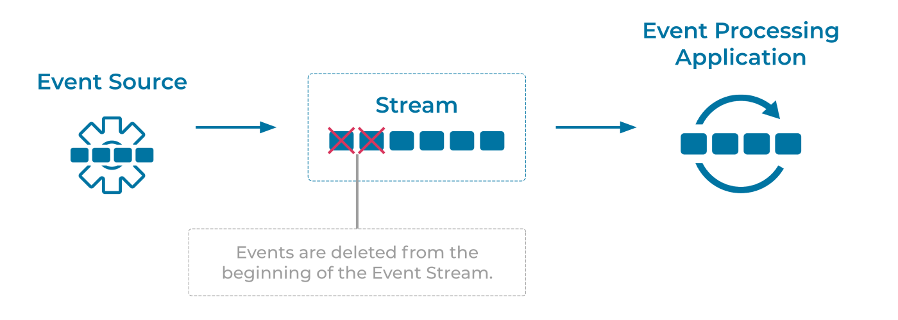

---
seo:
  title: Limited Retention Event Stream
  description: Limited Retention Event Streams allow outdated or otherwise undesired events to be removed from an Event Stream.
---

# Limited Retention Event Stream
Many use cases allow for [Events](../event/event.md) to be removed from an [Event Stream](../event-stream/event-stream.md) in order to preserve space and prevent the reading of stale data.

## Problem
How can we remove events from an Event Stream based on a criteria, such as event age or Event Stream size?

## Solution


The solution for limited retention will depend on the [Event Streaming Platform](../event-stream/event-streaming-platform.md). Most platforms will allow for deletion of events using an API or with an automated process configured within the platform itself. Because Event Streams are modeled as immutable event logs in the [Event Store](../event-storage/event-store.md), events will be removed from the beginning of an Event Stream moving forward (i.e., oldest events are being removed first). [Event Processing Applications](../event-processing/event-processing-application.md) that are reading from the stream will not be given the deleted events.

## Implementation
Apache Kafka® implements a Limited Retention Event Stream by default. With Kafka, Event Streams are modeled as [Topics](https://docs.confluent.io/platform/current/kafka/introduction.html#main-concepts-and-terminology). Kafka provides two types of retention policy, which can be configured on a per-topic basis or as a default for new topics.

### Time-Based Retention
With time-based retention, events will be removed from the topic after the event timestamp indicates an event is older than the configured log retention time. On Kafka this is configured with the `log.retention.hours` setting, which can be set as a default to apply to all topics or on a per-topic basis. Additionally, Kafka respects a `log.retention.minutes` and `log.retention.ms` settings to define shorter retention periods.

The following example sets the retention period of a topic to one year: 

```bash
log.retention.hours=168
```

### Size-Based Retention
With size-based retention, events will begin to be removed from the topic once the total size of the topic violates the configured maximum size. Kafka supports a `log.retention.bytes` configure. For example, to configure the maximum size of a topic to 100GB you could set the configuration as follows: 
 
```bash
log.retention.bytes=107374127424
```

For more guidance and configuring retention, see the [Kafka Broker Configurations documentation](https://docs.confluent.io/platform/current/installation/configuration/broker-configs.html) for default settings, or the [Modifying Topics](https://docs.confluent.io/platform/current/kafka/post-deployment.html#modifying-topics) section for modifying existing topics.

For either method of configuring retention, Kafka _does not immediately_ remove events one by one when they violate the configured retention settings. To understand how they are removed, we first need to explain that Topics are further broken down into partitions (see [Partitioned Placement](../event-stream/partitioned-placement.md)). Partitions themselves are further divided into files on disk called segments. Segments represent a sequence of the events in a particular partition, and these files are what is removed once a violation of the retention policy has occurred. Additionally, the cleaning algorithm is subject to additional configuration such as `log.retention.check.interval.ms` and segment configuration, such as `log.segment.bytes`. 


## Considerations
* When Event Streams have limited retention, consideration for failure scenarios should be taken. If there is a need for event Processing Applications to observe all events at least once, the configured retention must cover time frames of potential outages experienced by applications. For example, if an Operations team has an SLA of 2 business days (Mon to Fri) for a non-mission-critical Kafka use case, then retention should be set to at least 4 days to cover for incidents that happen right before or during the weekends.

## References
* This pattern is similar to [Message Expiration](https://www.enterpriseintegrationpatterns.com/patterns/messaging/MessageExpiration.html) in Enterprise Integration Patterns by Gregor Hohpe and Bobby Woolf
<!-- TODO: the following link needs to be to the new DCI 101 course-->
* [Apache Kafka 101: Introduction](https://www.youtube.com/watch?v=qu96DFXtbG4) provides a primer on "What is Kafka, and how does it work?"
* A related pattern is the [Infinite Retention Event Stream](infinite-retention-event-stream.md) pattern which details Event Streams that stores events indefinitely.
