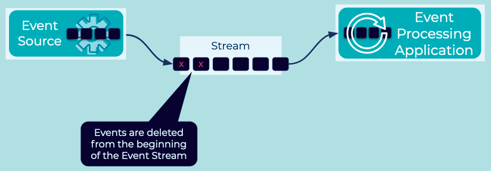

---
seo:
  title: Limited Retention Event Stream
  description: Limited Retention Event Streams allow oudated or otherwise undesired Events to be removed from an Event Stream.
---

# Limited Retention Event Stream
Many use cases allow for [Events](../event/event.md) to be removed from an [Event Stream](../event-stream/event-stream.md) in order to preserve space and prevent the reading of stale data.

## Problem
How can we remove [Events](../event/event.md) from an [Event Stream](../event-stream/event-stream.md) based on a criteria, such as [Event](../event/event.md) age or [Event Stream](../event-stream/event-stream.md) size?

## Solution


The solution for limited retention will depend on the [Event Streaming Platform](../event-stream/event-streaming-platform.md). Most platforms will allow for deletion of [Events](../event/event.md) using an API or with an automated process configured within the platform itself. Because [Event Streams](../event-stream/event-stream.md) are modeled as immutable [Event](../event/event.md) logs, [Events](../event/event.md) will be removed from the beginning of an [Event Stream](../event-stream/event-stream.md) moving forward. [Event Processing Applications](../event-processing/event-processing-application.md) which are reading [Events](../event/event.md) will not be given the deleted [Events](../event/event.md), instead the stream will logically start with the more recent [Events](../event/event.md) that have not been removed.

## Implementation
Apache Kafka® implements a Limited Retention Event Stream by default. With Kafka, [Event Streams](../event-stream/event-stream.md) are modeled as [Topics](https://docs.confluent.io/platform/current/kafka/introduction.html#main-concepts-and-terminology). Kafka provides two types of retention policy which can be configured on a per-topic basis or as a default for new topics.

### Time Based Retention
With time based retention, [Events](../event/event.md) will be removed from the topic after the [Event](../event/event.md) timestamp indicates an [Event](../event/event.md) is older than the configured log retention time. On Kafka this is configured with the `log.retention.ms` setting which can be set by default or on a per topic basis. Additionally, Kafka respects a `log.retention.minutes` and `log.retention.hours` setting which eases the configuration burden for long retention periods. For example, to configure retention for 7 days you could set the value to 168 hours.

```bash
log.retention.hours=168
```

### Size Based Retention
With size based retention, [Events](../event/event.md) will begin to be removed from the topic once the total size of the topic violates the configured maximum size. Kafka supports a `log.retention.bytes` configure. For example, to configure the maximum size of a topic to 100GB you could set the configuration as follows: 
 
```bash
log.retention.bytes=107374127424
```

For either method of configuring retention, Kafka _does not immediately_ remove [Events](../event/event.md) one by one when they violate the configured retention settings. To understand how they are removed, we first need to explain that Topics are further broken down into partitions (see [Partitioned Placement](../event-stream/partitioned-placement.md)). Partitions themselves are further divided into files on disk called segments. Segements represent a sequence of the [Events](../event/event.md) in a particular partition, and these files are what is removed once a violation of the retention policy has occurred. Additionally, the cleaning algorithm is subject to additional configuration such as `log.retention.check.interval.ms` and segement configuration, such as `log.segment.bytes`. The [Apache Kafka documentation](https://kafka.apache.org/documentation/) goes into more detail.

## Considerations
* When [Event Streams](../event-stream/event-stream.md) have limited retention, consideration for failure scenarios should be taken. If there is a need for [Event Processing Applications](../event-processing/event-processing-application.md) to observe all [Events](../event/event.md) at least once, the configured retention must cover timeframes of potential outages experienced by applications.

## References
* This pattern is similiar to [Message Expiration](https://www.enterpriseintegrationpatterns.com/patterns/messaging/MessageExpiration.html) in Enterprise Integration Patterns by Gregor Hohpe and Bobby Woolf
<!-- TODO: the following link needs to be to the new DCI 101 course-->
* [Apache Kafka 101: Introduction](https://www.youtube.com/watch?v=qu96DFXtbG4) provides a primer on "What is Kafka, and how does it work?"
* A related pattern is the [Infinite Retention Event Stream](infinite-retention-event-stream.md) pattern which details [Event Streams](../event-stream/event-stream.md) that stores [Events](../event/event.md) indefinitely.
