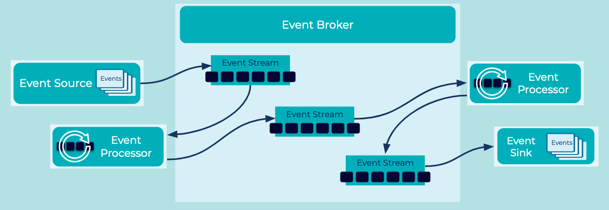

# Event Broker
Loosely coupled components allow my applications to change with minimal impact on dependent systems. This loose coupling also allows my development teams to efficiently work asynchronously with respect to one another. 

## Problem
How can I decouple [Event Sources](../event-source/event-source.md) from [Event Sinks](../event-sink/event-sink.md), both of which may include cloud services, systems like relational databases, as well as applications and microservices?

## Solution

Use a central Event Broker that routes Events to related [Event Streams](../event-stream/event-streams.md). Producers of [Events](../event/event.md) are isolated from the consumers of them. The components are coupled by a shared understanding of the name and data format of the shared Event Stream only. The Event Broker handles the complications of client applications connecting and disconnecting, and consumers are responsible for their individual progress of processing from the Event Stream.

## Implementation
[Apache Kafka](https://kafka.apache.org/) is an open-source distributed [Event Streaming Platform](../event-stream/event-streaming-platform.md) which implements this Event Broker pattern. Kafka runs as a highly scalable and fault-tolerant cluster of brokers. In parallel, [Event Processing Applications](../event-processing/event-processing-application.md) produce, consume, and process Events from the cluster using a loosely coupled but coordinated design.

## Considerations
* Counter to traditional message brokers, Event Brokers provide a data persistence layer that allows client applications to initiate and resume Event production and consumption independently. 

## References
* This pattern is derived from [Message Broker](https://www.enterpriseintegrationpatterns.com/patterns/messaging/MessageBroker.html) in Enterprise Integration Patterns by Gregor Hohpe and Bobby Woolf
