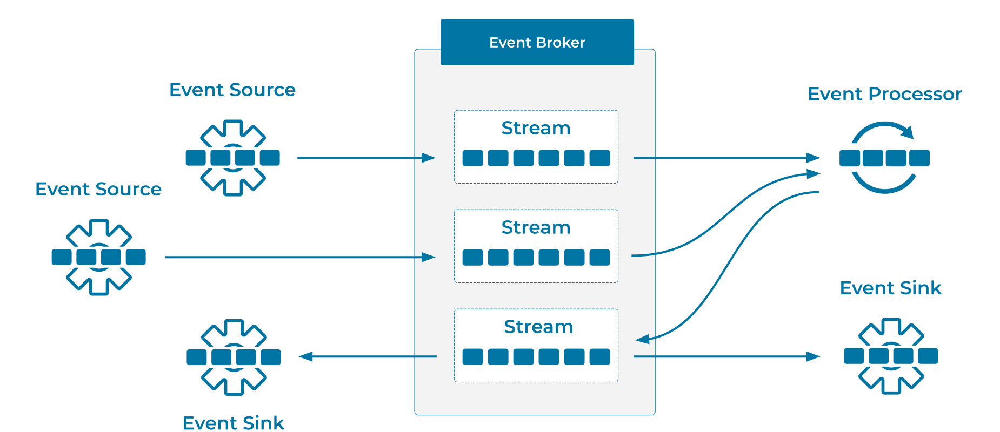

---
seo:
  title: Event Broker
  description: Event Brokers allow applications and services to communicate in a loosely-coupled manner. Multiple brokers are deployed as a distributed cluster to ensure elasticity, scalability, and fault-tolerance during operations.
---

# Event Broker
In a software architecture, loosely-coupled components allow services and applications to change with minimal impact on their dependent systems and applications. On the side of the organization, this loose coupling also allows different development teams to efficiently work independently of each other.

## Problem
How can we decouple [Event Sources](../event-source/event-source.md) from [Event Sinks](../event-sink/event-sink.md), given that both may include cloud services, systems such as relational databases, and applications and microservices?

## Solution

We can use the Event Broker of an [Event Streaming Platform](../event-stream/event-streaming-platform.md) to provide this decoupling. Typically, multiple event brokers are deployed as a distributed cluster to ensure elasticity, scalability, and fault-tolerance during operations. Event brokers collaborate on receiving and durably storing [Events](../event/event.md) (write operations) as well as serving events (read operations) into [Event Streams](../event-stream/event-stream.md) from one or many clients in parallel. Clients that produce events are called [Event Sources](../event-source/event-source.md), and are decoupled and isolated, through the brokers, from clients that consume the events, which are called [Event Sinks](../event-sink/event-sink.md). 

Typically, the technical architecture follows the design of "dumb brokers, smart clients." Here, the broker intentionally limits its client-facing functionality to achieve the best performance and scalability. This means that additional work must be performed by the broker's clients. For example, unlike in traditional messaging brokers, it is the responsibility of an event sink (a consumer) to track its individual progress of reading and processing from an event stream.

## Implementation
[Apache Kafka®](https://kafka.apache.org/) is an open-source, distributed [Event Streaming Platform](../event-stream/event-streaming-platform.md), which implements the Event Broker pattern. Kafka runs as a highly scalable and fault-tolerant cluster of brokers. Many [Event Processing Applications](../event-processing/event-processing-application.md) can produce, consume, and process Events from the cluster in parallel, with strong guarantees such as transactions, using a fully decoupled and yet coordinated architecture.

Additionally, Kafka's protocol provides strong backwards compatibility and forwards compatibility guarantees between the server-side brokers and their client applications that produce, consume, and process events. For example, client applications using a new version of Kafka can work with a cluster of brokers running an older version of Kafka. Similarly, older client applications continue to work even when the cluster of brokers is upgraded to a newer version of Kafka (and Kafka also supports in-place version upgrades of clusters). This is another example of decoupling the various components in a Kafka-based architecture, resulting in even better flexibility during design and operations.

## Considerations
* In contrast to traditional message brokers, event brokers provide a distributed, durable, and fault-tolerant storage layer. This has several important benefits. For instance, client applications can initiate and resume event production and consumption independently from each other. Similarly, the client applications don't need to be connected to the brokers perpetually in order to not miss any events. When an application is taken offline for maintenance and subsequently restarted, it will then automatically resume its consumption and processing of an event stream exactly at the point where it stopped before. The strong guarantees provided by the brokers in the Event Streaming Platform ensure that applications do not suffer from duplicate data or from data loss (for example, missing out on events that were written during the maintenance window) in these situations, even in the face of failures such as machine or network outages. Another benefit is that client applications can "rewind the time" and re-consume historical data in event streams as often as needed. This is useful in many situations, including A/B testing, auditing and compliance, and training and retraining models for machine learning, as well as when fixing unexpected application errors and bugs that occurred in production.

## References
* This pattern is derived from [Message Broker](https://www.enterpriseintegrationpatterns.com/patterns/messaging/MessageBroker.html) in _Enterprise Integration Patterns_, by Gregor Hohpe and Bobby Woolf.
