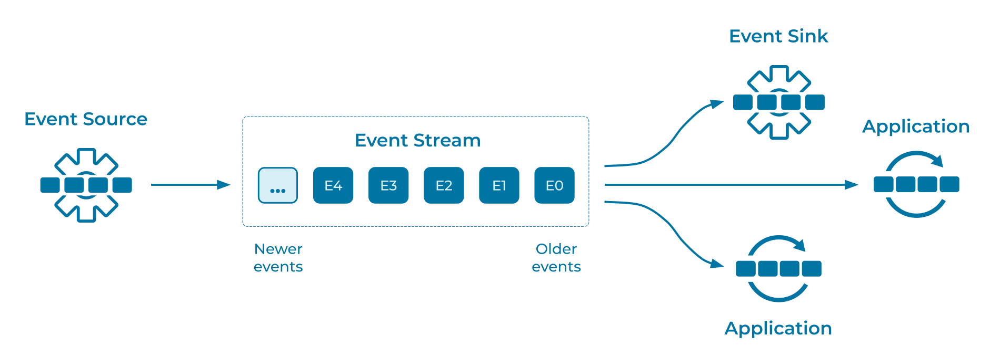

---
seo:
  title: Event Stream
  description: Event Streams are the communication mechanism of Event Processing Applications. You can connect Event Processing Applications together using an Event Stream. Event Streams are often named and contain Events of a well-known format.
---
# Event Stream
[Event Processing Applications](../event-processing/event-processing-application.md) need to communicate, and ideally the communication is based on [Events](../event/event.md). The applications need a standard mechanism to use for this communication.

## Problem
How can [Event Processors](../event-processing/event-processor.md) and applications communicate with each other using event streaming?

## Solution


Connect the Event Processing Applications with an Event Stream. [Event Sources](../event-source/event-source.md) produce events to the Event Stream, and Event Processors and [Event Sinks](../event-sink/event-sink.md) consume them. Event Streams are named, allowing communication over a specific stream of events. Notice how Event Streams decouple the source and sink applications, which communicate indirectly and asynchronously with each other through events. Additionally, event data formats are often validated, in order to govern the communication between applications.

Generally speaking, an Event Stream records the history of what has happened in the world as a sequence of events (think: a sequence of facts). Examples of streams would be a sales ledger or the sequence of moves in a chess match. This history is an ordered sequence or chain of events, so we know which event happened before another event and can infer causality (for example, “White moved the e2 pawn to e4; then Black moved the e7 pawn to e5”). A stream thus represents both the past and the present: as we go from today to tomorrow -- or from one millisecond to the next -- new events are constantly being appended to the history.

Conceptually, a stream provides _immutable_ data. It supports only inserting (appending) new events, and existing events cannot be changed. Streams are persistent, durable, and fault-tolerant. Unlike traditional message queues, events stored in streams can be read as often as needed by Event Sinks and Event Processing Applications, and they are not deleted after consumption. Instead, retention policies control how events are retained. Events in a stream can be _keyed_, and we can have many events for one key. For a stream of payments of all customers, the customer ID might be the key (cf. related patterns such as [Partitioned Parallelism](../event-stream/partitioned-parallelism.md)).

## Implementation
In [Apache Kafka®](/learn-kafka/apache-kafka/intro/), Event Streams are called _topics_. Kafka allows you to define policies which dictate how events are retained, using [time or size limitations](../event-storage/limited-retention-event-stream.md) or [retaining events forever](../event-storage/infinite-retention-event-stream.md). Kafka consumers (Event Sinks and Event Processing Applications) are able to decide where in an event stream to begin reading. They can choose to begin reading from the oldest or newest event, or seek to a specific location in the topic, using the event's timestamp or position (called the _offset_).

The streaming database [ksqlDB](https://ksqldb.io/) supports Event Streams using a familiar SQL syntax. The following example creates a stream of events named `riderLocations`, representing locations of riders in a car-sharing service. The data format is JSON.
```sql
CREATE STREAM riderLocations (profileId VARCHAR, latitude DOUBLE, longitude DOUBLE)
  WITH (kafka_topic='locations', value_format='json');
```

New events can be written to the `riderLocations` stream using the `INSERT` syntax:
```sql
INSERT INTO riderLocations (profileId, latitude, longitude) VALUES ('c2309eec', 37.7877, -122.4205);
INSERT INTO riderLocations (profileId, latitude, longitude) VALUES ('18f4ea86', 37.3903, -122.0643);
INSERT INTO riderLocations (profileId, latitude, longitude) VALUES ('4ab5cbad', 37.3952, -122.0813);
INSERT INTO riderLocations (profileId, latitude, longitude) VALUES ('8b6eae59', 37.3944, -122.0813);
INSERT INTO riderLocations (profileId, latitude, longitude) VALUES ('4a7c7b41', 37.4049, -122.0822);
INSERT INTO riderLocations (profileId, latitude, longitude) VALUES ('4ddad000', 37.7857, -122.4011);
```

A [push query](https://docs.ksqldb.io/en/latest/concepts/queries/#push), also known as a streaming query, can be run continuously over the stream using a `SELECT` command with the `EMIT CHANGES` clause. As new events arrive, this query will emit new results that match the `WHERE` conditionals. The following query looks for riders in close proximity to Mountain View, California, in the United States.
```sql
-- Mountain View lat, long: 37.4133, -122.1162
SELECT * FROM riderLocations
  WHERE GEO_DISTANCE(latitude, longitude, 37.4133, -122.1162) <= 5
  EMIT CHANGES;
```

## References
* This pattern is derived from [Message Channel](https://www.enterpriseintegrationpatterns.com/patterns/messaging/MessageChannel.html) in _Enterprise Integration Patterns_, by Gregor Hohpe and Bobby Woolf.
* See the [Kafka Storage & Processing Fundamentals page](/learn/kafka-storage-and-processing/) for essential details on Kafka 
