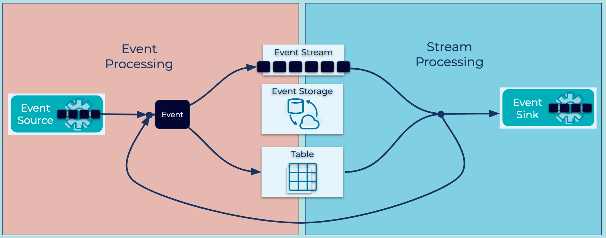

---
seo:
	title: Event Streaming Platform
	description:
---

# Event Streaming Platform
Companies are rarely built on a single datastore and a single application to interact with it. Typically a company may have hundreds or thousands of applications, databases, data warehouses, or other data stores. The company's data is spread across these resources and the interconnection between them is immensely complicated. In larger enterprises, multiple lines of business can complicate the situation even further. Modern software architectures, like microservices and SAS applications, are also adding complexity as engineers are tasked with weaving the entire infastructure together cohesively.

Furthermore, companies can no longer survive without reacting to [Events](../event/event.md) within their business in real time. Customers and business partners expect immediate reactions and rich interactive applications. Today, data is in motion, and engineering teams needs to model applications to process business requirements as a stream of [Events](../event/event.md), not as data at rest sitting idly in a traditional data store.

## Problem
What architecture can we use that allows us to model everything within our business as streams of [Events](../event/event.md), creating a modern, fault tolerant, and scalable platform for building modern applications?

## Solution

We can design business processes and applications around [Event Streams](../event-stream/event-stream.md). Everything from sales, orders, trades, customer experiences, sensor readings and database updates are modeled as an [Event](../event/event.md). [Events](../event/event.md) are written to the Event Streaming Platform once, allowing distributed functions within the business to react in real time. Systems external to the Event Streaming Platform are integrated using [Event Sources](../event-source/event-source.md) and [Event Sinks](../event-sink/event-sink.md). Business logic is built within [Event Processing Applications](../event-processing/event-processing-application.md) which are composed of [Event Processors](../event-processing/event-processor.md) that read and write [Events](../event/even.md) from [Event Streams](../event-stream/event-stream.md).

## Implementation

Apache Kafka® is the most popular Event Streaming Platform, designed to address the business requirements in a modern distributed architecture. Kafka allows reading, writing, processing, and reacting to [Event Streams](../event-stream/event-stream.md) in a way that's horizontally scalable, fault-tolerant, and simple to use. Kafka is built upon many of the patterns described in this [Event Streaming Patterns](../index.md) site.

### Fundamentals
Data in Kafka is exchangeed as [Events](../event/event.md) which represent facts about something that has occurred. Examples of [Events](../event/event.md) include orders, payments, activities, or measurements. In Kafka, [Events](../event/event.md) are referred to as _Records_ and they contain data and metadata describing the [Event](../event/event.md).

[Events](../event/event.md) are written to and read from [Event Streams](../event-stream/event-stream.md). In Kafka, these streams are called Topics. Topics have names and generally contain highly related records. Topics are modeled as durable, distributed, append only logs. See this [Apache Kafka 101 video](https://www.youtube.com/watch?v=kj9JH3ZdsBQ) for more details on Topics.

Applications wishing to write [Events](../event/event.md) to topics are called [Producers](https://docs.confluent.io/platform/current/clients/producer.html). Producers may come in many forms and can be generalized in the pattern [Event Source](../event-source/event-source.md). Reading [Events](../event/event.md) is performed by [Consumers](https://docs.confluent.io/platform/current/clients/consumer.html). Consumers can operate in a coordiated fashion to increase scale and fault tolerance.

### Stream Processing
[Event Processing Applications](../event-processing/event-processing-application.md) can be built using a variety of techniques on top of Kafka. 

#### ksqlDB
[ksqlDB](https://ksqldb.io) is the event streaming database which allows you to build [Event Processing Applications](../event-processing/event-processing-application.md) using a well known declarative `SQL` language.

#### Kafka Streams
[Kafka Streams](https://kafka.apache.org/documentation/streams/) is a client library, providing an Domain Specific Language (DSL) Api built specifically for [Event Processing Application](../event-processing/event-processing-application.md) development.

### Data Integrations 

[Kafka Connect](https://docs.confluent.io/platform/current/connect/index.html) is a framework for scalably an reliably integrating data systems external to Kafka into the Event Streaming Platform. Getting existing data systems onto Kafka may be the first step in the adopting of an Event Streaming Platform.

[Source Connectors](../event-source/event-source-connector.md) pull data into Kafka topics from sources such as traditional databases, cloud object storage services, or SaaS products like Salesforce. Advanced integrations are possible with patterns such as [Database Write Through](../event-source/database-write-through.md) and [Database Write Aside](../event-source/database-write-aside.md).

[Sink Connectors](../event-sink/event-sink-connector.md) are the complementary pattern to [Source Connectors](../event-source/event-source.md). While Source Connectors bring data to the Event Streaming Paltform, Sinks deliver data from Kafka streams into external systems. Common destinatino systems include Elasticsearch, cloud data warehouse services, or function based serverless compute services.

## Considerations 

## References
* This pattern is derived from [Message Bus](https://www.enterpriseintegrationpatterns.com/patterns/messaging/MessageBus.html) in Enterprise Integration Patterns by Gregor Hohpe and Bobby Woolf
* [Confluent Cloud](https://www.confluent.io/confluent-cloud/) is a cloud-native service for Apache Kafka®
* [Apache Kafka 101: Introduction](https://www.youtube.com/watch?v=qu96DFXtbG4) provides a primer on "What is Kafka, and how does it work?"
