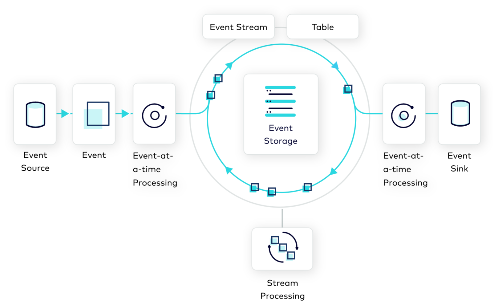

---
seo:
  title: Event Streaming Platform
  description: An Event Streaming Platform, such as Apache Kafka®, allows businesses to design processes and applications around Event Streams.
---

# Event Streaming Platform
Companies are rarely built on a single data store and a single application to interact with it. Typically, a company may have hundreds or thousands of applications, databases, data warehouses, or other data stores. The company's data is spread across these resources, and the interconnection between them is immensely complicated. In larger enterprises, multiple lines of business can complicate the situation even further. Modern software architectures, such as microservices and SaaS applications, also add complexity, as engineers are tasked with weaving the entire infrastructure together cohesively.

Furthermore, companies can no longer survive without reacting to [Events](../event/event.md) within their business in real time. Customers and business partners expect immediate reactions and rich interactive applications. Today, data is in motion, and engineering teams need to model applications to process business requirements as streams of events, not as data at rest, sitting idly in a traditional data store.

## Problem
What architecture can we use to model everything within our business as streams of events, creating a modern, fault-tolerant, and scalable platform for building modern applications?

## Solution

We can design business processes and applications around [Event Streams](../event-stream/event-stream.md). Everything, from sales, orders, trades, and customer experiences to sensor readings and database updates, is modeled as an [Event](../event/event.md). Events are written to the Event Streaming Platform once, allowing distributed functions within the business to react in real time. Systems external to the Event Streaming Platform are integrated using [Event Sources](../event-source/event-source.md) and [Event Sinks](../event-sink/event-sink.md). Business logic is built within [Event Processing Applications](../event-processing/event-processing-application.md), which are composed of [Event Processors](../event-processing/event-processor.md) that read events from and write events to Event Streams.

## Implementation

Apache Kafka® is the most popular Event Streaming Platform, designed to address the business requirements of a modern distributed architecture. You can use Kafka to read, write, process, query, and react to [Event Streams](../event-stream/event-stream.md) in a way that's horizontally scalable, fault-tolerant, and simple to use. Kafka is built upon many of the patterns described in [Event Streaming Patterns](../index.md).

### Fundamentals
Data in Kafka is exchanged as events, which represent facts about something that has occurred. Examples of events include orders, payments, activities, and measurements. In Kafka, events are sometimes also referred to as _records_ or _messages_, and they contain data and metadata describing the event.

Events are written to, stored in, and read from [Event Streams](../event-stream/event-stream.md). In Kafka, these streams are called _topics_. Topics have names and generally contain "related" records of a particular use case, such as customer payments. Topics are modeled as durable, distributed, append-only logs in the [Event Store](../event-storage/event-store.md). For more details about Kafka topics, see the [Apache Kafka 101 course](/learn-kafka/apache-kafka/events/).

Applications that write events to topics are called [Producers](https://docs.confluent.io/platform/current/clients/producer.html). Producers come in many forms and represent the [Event Source](../event-source/event-source.md) pattern. Reading events is performed by [Consumers](https://docs.confluent.io/platform/current/clients/consumer.html), which represent [Event Sinks](../event-sink/event-sink.md). Consumers typically operate in a distributed, coordinated fashion to increase scale and fault tolerance. [Event Processing Applications](../event-processing/event-processing-application.md) act as both event sources and event sinks. 

Applications which produce and consume events as described above are referred to as "clients." These client applications can be authored in a variety of programming languages, including [Java](https://docs.confluent.io/clients-kafka-java/current/), [Go](https://docs.confluent.io/clients-confluent-kafka-go/current/), [C/C++](https://docs.confluent.io/clients-librdkafka/current/), [C# (.NET)](https://docs.confluent.io/clients-confluent-kafka-dotnet/current/), and [Python](https://docs.confluent.io/clients-confluent-kafka-python/current/).
<!-- TODO: The links above need to be to the DCI getting started guides-->

### Stream Processing
[Event Processing Applications](../event-processing/event-processing-application.md) can be built atop Kafka using a variety of techniques. 

#### ksqlDB
The streaming database [ksqlDB](https://ksqldb.io) allows you to build [Event Processing Applications](../event-processing/event-processing-application.md) using SQL syntax. It ships with an API, command line interface (CLI), and GUI. ksqlDB's elastic architecture decouples its distributed compute layer from its distributed storage layer, which uses and tightly integrates with Kafka.

#### Kafka Streams
The Kafka client library [Kafka Streams](https://docs.confluent.io/platform/current/streams/index.html) allows you to build elastic applications and microservices on the JVM, using languages such as Java and Scala. An application can run in a distributed fashion across multiple instances for better scalability and fault-tolerance.

### Data Integrations 

The [Kafka Connect](https://docs.confluent.io/platform/current/connect/index.html) framework allows you to scalably and reliably integrate cloud services and data systems external to Kafka into the Event Streaming Platform. Data from these systems is set in motion by being continuously imported and/or exported as [Event Streams](../event-stream/event-stream.md) through Kafka _connectors_. There are hundreds of ready-to-use Kafka connectors available on [Confluent Hub](https://www.confluent.io/hub/). On-boarding existing data systems into Kafka is often the first step in the journey of adopting an Event Streaming Platform. 

[Source Connectors](../event-source/event-source-connector.md) pull data into Kafka topics from sources such as traditional databases, cloud object storage services, or SaaS products such as Salesforce. Advanced integrations are possible with patterns such as [Database Write Through](../event-source/database-write-through.md) and [Database Write Aside](../event-source/database-write-aside.md).

[Sink Connectors](../event-sink/event-sink-connector.md) are the complementary pattern to [Source Connectors](../event-source/event-source.md). While source connectors bring data into the Event Streaming Platform continuously, sinks continuously deliver data from Kafka streams to external cloud services and systems. Common destination systems include cloud data warehouse services, function-based serverless compute services, relational databases, Elasticsearch, and cloud object storage services.

## Considerations 
Event Streaming Platforms are distributed computing systems made up of a diverse set of components. Because building and operating such a platform requires significant engineering expertise and resources, many organizations opt for a fully-managed Kafka service such as [Confluent Cloud](https://www.confluent.io/confluent-cloud/), rather than self-managing the platform, so that they can focus on creating business value.

## References
* This pattern is derived from [Message Bus](https://www.enterpriseintegrationpatterns.com/patterns/messaging/MessageBus.html) in _Enterprise Integration Patterns_, by Gregor Hohpe and Bobby Woolf.
* [Confluent Cloud](https://www.confluent.io/confluent-cloud/) is a cloud-native service for Apache Kafka®.
<!-- TODO: the following link needs to be to the new DCI 101 course-->
* The video [Apache Kafka 101: Introduction](https://www.youtube.com/watch?v=qu96DFXtbG4) provides a primer on what Kafka is and how it works.
