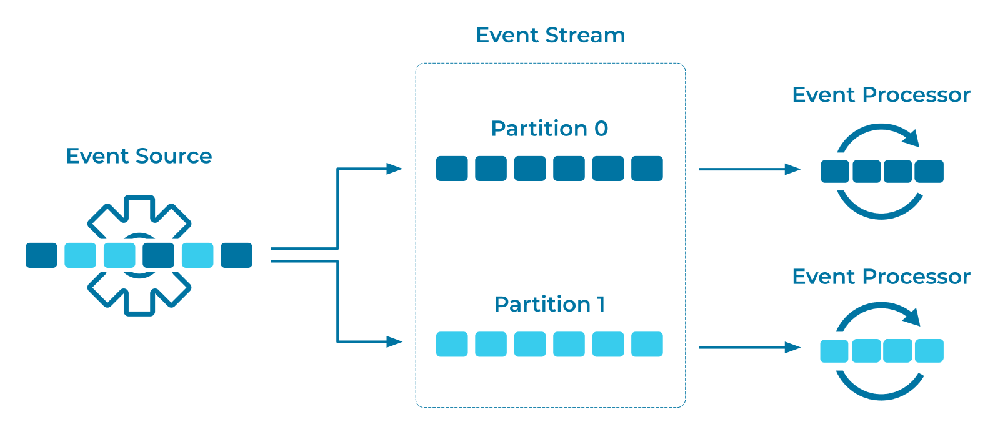

---
seo:
  title: Partitioned Parallelism
  description: A partition is a unit of parallelism that enables concurrent reading, writing, and processing of events at scale.
---

# Partitioned Parallelism
If service goals mandate high throughput, it is useful to be able to distribute event storage, as well as event production and consumption, for parallel processing.
Distributing and concurrently processing events enables an application to scale.

## Problem
How can I allocate events across [Event Streams](../event-stream/event-stream.md) and [Tables](../table/state-table.md) so that they can be concurrently processed by distributed [Event Processors](../event-processing/event-processor.md)?

## Solution


Use a partitioned event stream, and then assign the events to different partitions of the stream. Essentially, a partition is a unit of parallelism for storing, reading, writing, and processing events. Partitioning enables concurrency and scalability in two main ways:

* Platform scalability: different [Event Brokers](../event-stream/event-broker.md) can concurrently store and serve [Events](../event/event.md) to [Event Processing Applications](../event-processing/event-processing-application.md)
* Application scalability: different [Event Processing Applications](../event-processing/event-processing-application.md) can process [Events](../event/event.md) concurrently

Event partitioning also impacts application semantics: placing events into a given partition guarantees that the _ordering_ of events is preserved per partition (but typically not across different partitions of the same stream). This ordering guarantee is crucial for many use cases; very often, the sequencing of events is important (for example, when processing retail orders, an order must be paid before it can be shipped).

## Implementation
With Apache Kafka®, streams (called _topics_) are created either by an administrator or by a streaming application such as the streaming database [ksqlDB](https://ksqldb.io). The number of partitions is specified at the time the topic is created. For example:

```
confluent kafka topic create myTopic --partitions 30
```

[Events](../event/event.md) are placed into a specific partition according to the partitioning algorithm of the [Event Source](../event-source/event-source.md), such as an [Event Processing Application](../event-processing/event-processing-application.md).
All events assigned to a given partition have strong ordering guarantees.

The common partitioning schemes are:

1. Partitioning based on the event key (such as the customer ID for a stream of customer payments), where events with the same key are stored in the same partition
2. Round-robin partitioning, which provides an even distribution of events per partition
3. Custom partitioning algorithms, tailored to specific use cases

In a Kafka-based technology, such as a [Kafka Streams application](https://docs.confluent.io/platform/current/streams/index.html) or [ksqlDB](https://ksqldb.io/), the processors can scale by working on a set of partitions concurrently and in a distributed manner.
If an event stream's key content changes because of how the query is processing the rows -- for example, to execute a `JOIN` operation in ksqlDB between two streams of events -- the underlying keys are recalculated, and the events are sent to a new partition in the new topic to perform the computation. (This internal operation is often called _distributed data shuffling_.)

```
CREATE STREAM stream_name
  WITH ([...,]
        PARTITIONS=number_of_partitions)
  AS SELECT select_expr [, ...]
  FROM from_stream
  PARTITION BY new_key_expr [, ...]
  EMIT CHANGES;
```

## Considerations
In general, a higher number of stream partitions results in higher throughput. To maximize throughput, you need enough partitions to utilize all distributed instances of an [Event Processor](../event-processing/event-processor.md) (for example, servers in a ksqlDB cluster).
Be sure to choose the partition count carefully based on the throughput of [Event Sources](../event-source/event-source.md) (such as Kafka producers, including connectors), [Event Processors](../event-processing/event-processor.md) (such as ksqlDB or Kafka Streams applications), and [Event Sinks](../event-sink/event-sink.md) (such as Kafka consumers, including connectors). Also be sure to benchmark performance in the environment.
Plan the design of data patterns and key assignments so that events are distributed as evenly as possible across the stream partitions.
This will prevent certain stream partitions from being overloaded relative to other stream partitions. See the blog post [Streams and Tables in Apache Kafka: Elasticity, Fault Tolerance, and Other Advanced Concepts](https://www.confluent.io/blog/kafka-streams-tables-part-4-elasticity-fault-tolerance-advanced-concepts/) to learn more about partitions and dealing with partition skew.

## References
* The blog post [How to choose the number of topics/partitions in a Kafka cluster?](https://www.confluent.io/blog/how-choose-number-topics-partitions-kafka-cluster) provides helpful guidance for selecting partition counts for your topics.
* For a processing parallelism approach that subdivides the unit of work from a partition down to an event or event key, see the [Confluent Parallel Consumer for Kafka](https://github.com/confluentinc/parallel-consumer).
